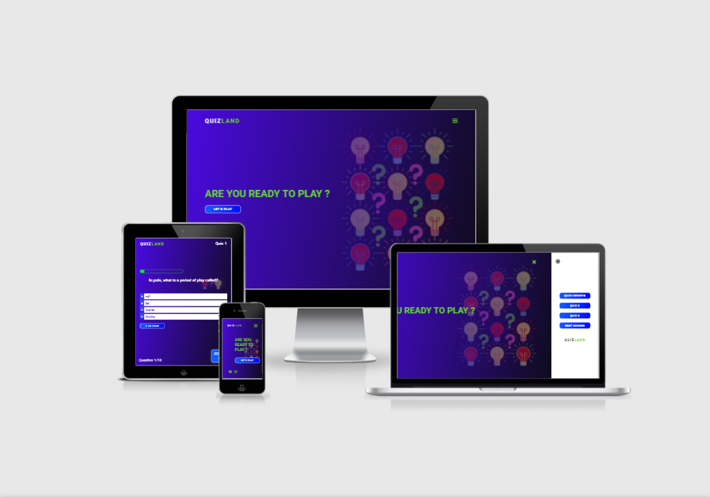
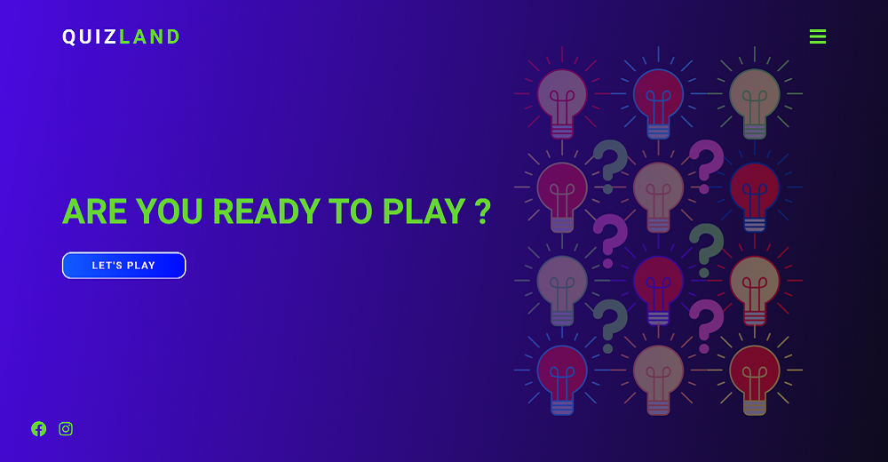
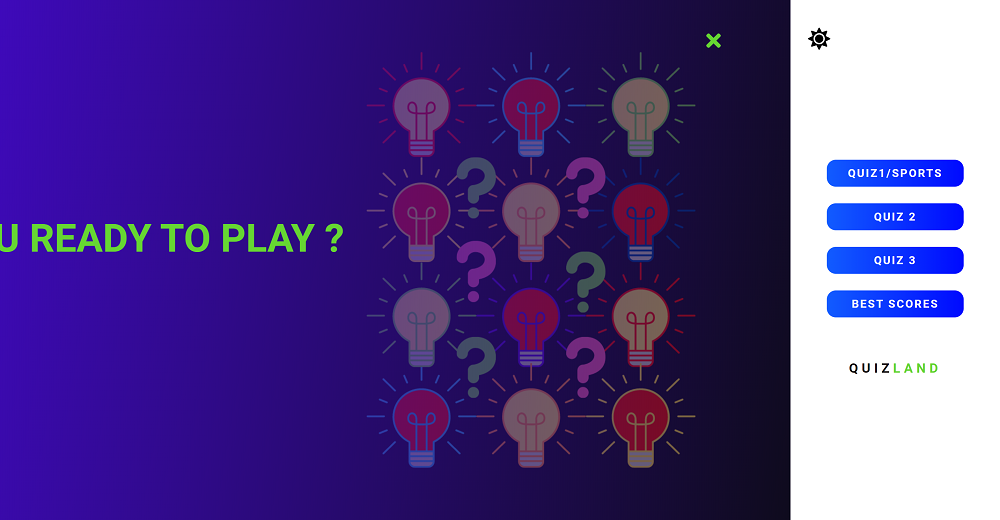
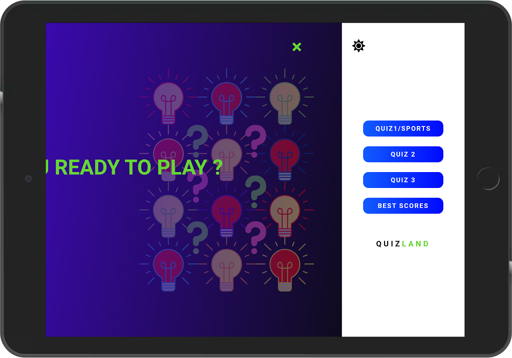
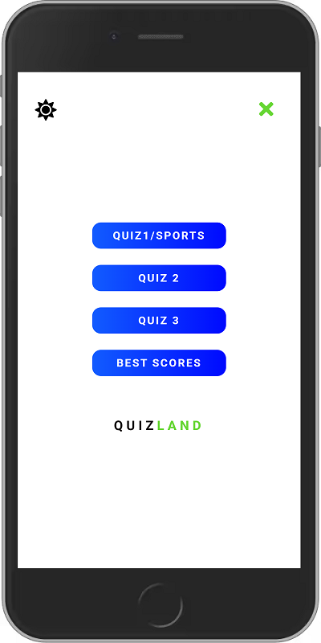

# Quiz Land - Game

# Introduction
Project milestone 2 for Code Institute Full-stack development program: JavaScript Essentials.

Quiz Land is a quiz game that allows players to test their knowledge in different topics. In Quiz Land are available 3 differents quizzes and has 10 questions for each topic and if they could answer the question correctly they will receive points. Quiz Land is a good way to have fun and also learn while playing a game.

[Live Project Here](https://pedrocristo.github.io/portfolio_project_1/index.html)

## README Table Content

* [Introduction](#introduction)
* [User Experience UX](#user-experience---UX)
    * [User stories](#user-stories)
* [Design](#Design)
        
    * [Website Structure](#website-structure)
    * [Colour Scheme](#colour-scheme)
    * [Typography](#typography)
    * [interactive Links](#interactive-links) 
* [Features](#features)  
    * [Home Page](#home-page) 
    * [Side Navigation Menu](#home-age-eader)
    * [Quiz Game 1](#about-section)
    * [Game End Page](#banner-section-1---bali) 
    * [Trophy Gold Page](#top-trips-section)
    * [Trophy Silver Page](#banner-section-2---maldives)
    * [Trophy Bronze Page](#city-breaks-section)
    * [Height Scores Page](#partners-section)
* [Future Features](#future-features)
    * [Customer Review Section](#customer-review-section)
* [Technologies Used](#technologies-used)
    * [Languages Used](#languages-used)
    * [Frameworks - Libraries - Programs Used](#frameworks---libraries---programs-used)
* [Testing](#testing)
    * [Bugs](#bugs)
    * [Website Development Issues](#website-development-issues)
* [Deployment](#deployment-this-project)
    * [Deployment This Project](#deployment-this-project)
    * [Forking This Project](#forking-this-project)
    * [Cloning This Project](#cloning-this-project)
* [Credits](#credits)
* [Content](#content)

## User Experience - UX

 ### User Stories

* As a website creator, I want to:
  
1. Build a online quiz that is visually appealing from the user’s first visit so they are intrigued to explore and play the game.
2. Build an easy to navigate and play the game for its users.
3. Build a quiz that is both enjoyable and challenging for the user.
   
* As a new visitor, I want to:

1. be able to understand the main purpose of the game.
2. Be able to easily navigate throughout the game and choose a quiz to play.
3. Be able to see my results after playing the game.
   
* As a returning visitor, I want to:

1. Be able to find new quizzes when they will be available.
2. Be able to check the Height Scores page
3. be able to challenge myself and improve on my scores.
   
## Design

### Wireframe
In this project I decided to build a prototype using the tool Canva before start work on the code. It was helpful for UI perspective as I could display the different elements 
in the screen and worked with them with the objective to build an application that would be easily used by the users. 
[Live Project Wireframe Here](https://cutt.ly/oIkZsAW)

### Website Structure
The Quiz Land is a nine pages website has been designed to look like an application in small devices.
#### Pages:
* Homepage
* Quiz 1/Sports
* Quiz 2/History
* Quiz 3/Geography
* Game End 
* Trophy Gold 
* Trophy Silver
* Trophy Bronze
* High Scores  

#### Colour Scheme
  
 The main colour scheme I chosen for this project is overall blue tones and purple with a darker colour for maximum user accessibility. I have choose a green color as interactive-color to make contrats with the background.

#### Typography
* The Roboto, sans-serif is used as the main font for the whole website.
      
#### Imagery
* 3 images were used as a background for the website pages.
* 1 image was used for the Favicon.
  
### Interactive Links  
* At the bottom of the Home page, users can access the game social media links (Facebook and Instagram). Once these icons are clicked they are opened in a new tab. 
  
## Features

### Home Page 

* When thee users reach the website, they are instantly greeted on the Homepage and they have access to the button where to start playing instantly. Also there is a sidebar opening by pressing the hamburger icon on the top right here users can start to play  but also choosing a different quiz or just check the High Scores bord. On the bottom right side the players can access to the game official social media pages. 
[Live Page Here](https://pedrocristo.github.io/portfolio_project_2/index.html)

### Navigation Menu

#### Side Navigation Menu Desktop

* At the top right of the website, users can find a hamburger menu that is fully responsive in all devices. In this navigation menu users can navigate to the different quizzes and also check the High Scores board. 
* 
  #### Side Navigation Menu Tablet
 

  #### Navigation Menu Mobile

  #### Navigation Menu Day/Night Mode

  * Menu Day/Night Mode. From 8am to 8pm users will access to the navigation menu when open in day mode (background-color white), from 8pm to 8am users will access to the same menu in night mode (background-color black).

### Quiz Game 1/Sports

* In this feature is where all the game happens. Here the users will see the questions and 4 choices as answers. The player will choose one and will see if the answer given is right or wrong. 
The topic of the questions in the quiz 1 is Sports.  
[Live Page Here](https://pedrocristo.github.io/portfolio_project_2/pages/game-1.html)

### Quiz Game 2/History

* This feature has the same purpose as the Quiz 1 but here the questions topic is History.  
[Live Page Here](https://pedrocristo.github.io/portfolio_project_2/pages/game-2.html)

### Quiz Game 3/Geography

* This feature has the same purpose as the Quiz 1 and Quiz 2 but here the questions topic is Georaphy.  
[Live Page Here](https://pedrocristo.github.io/portfolio_project_2/pages/game-3.html)

### Game End Page

* Game End feature is the page that users go after a quiz is finished. Here the players can see the last score and save their usernames. 
[Live Feature Here](pages/game-end.html)

### Trophy Gold Page

* This feature is a highlight banner where the user can see a travel deal and book the trip by clicking on ' Book now' and it will allow the user to ring the  
  Travel World office. 
[Live Feature Here](https://pedrocristo.github.io/portfolio_project_1/home.html#banner-bali)

### Trophy Silver Page

* This feature is a cards section where the top travel deals are displayed with information about the city, country, price, hotel name, hotel stars and duration of stay (number of days and nights). The card has a button where the user can book. When the user hovers over this, the box-shadow changes. 
[Live Feature Here](https://pedrocristo.github.io/portfolio_project_1/home.html#top-trips)

### Trophy Bronze Page

* This feature has the same purpose as the Top Trip Section. A modification to this section is when the user hovers over the card the user can zoom in on the image. 
[Live Feature Here](https://pedrocristo.github.io/portfolio_project_1/home.html#banner-maldivas)

### Height Scores Page

* This feature has the same purpose as the Top Trip Section. The difference  is when the card is hovered by the user the image zoom in. 
[Live Feature Here](https://pedrocristo.github.io/portfolio_project_1/home.html#city-trips)

## Future Features
  
### Customer Review Section

* Add a Customer Review Section in the Home page. This would allow users to offer suggestions on how to improve the website and display customers' experiences and their opinions of Travel World.

## Technologies Used

### Languages Used 

* [HTML5](https://en.wikipedia.org/wiki/HTML5).
* [CSS3](https://en.wikipedia.org/wiki/Cascading_Style_Sheets).
* [javaScript](https://www.javascript.com/).

### Frameworks - Libraries - Programs Used

* [Google Fonts:](https://fonts.google.com/)
   * Google fonts were used to import the 'Roboto' font throughout the style.css.
* [Font Awesome:](https://fontawesome.com/)
    * Font Awesome are used as an icons for user UX purposes.
* [Git](https://git-scm.com/)
    * Git was used for version control by utilizing the Gitpod terminal to commit to Git and Push to GitHub.
* [GitHub:](https://github.com/)
    * GitHub is used to store the project's code after being pushed from Git.
* [PIXLR:](https://pixlr.com/pt/)
    * PIXLR was used to create, modify and resize all images on this website.
* [Canva](https://www)
   * Canva was used to create the the 3 background images and also the Favicon
  
## Testing

The W3C Markup Validator and W3C CSS Validator Services were used to validate every page of the project to ensure there were no syntax errors in the project.

* [W3C Markup Validator](https://validator.w3.org/#validate_by_input) - [Website Results](https://validator.w3.org/nu/?doc=https%3A%2F%2Fpedrocristo.github.io%2Fportfolio_project_1%2Findex.html)
* [W3C CSS Validator](https://jigsaw.w3.org/css-validator/#validate_by_input) - [Website Results](https://jigsaw.w3.org/css-validator/validator?uri=https%3A%2F%2Fpedrocristo.github.io%2Fportfolio_project_1%2Findex.html&profile=css3svg&usermedium=all&warning=1&vextwarning=&lang=en).

Google Lighthouse was used to test Performance, Best Practices, Accessibility and SEO on both Desktop and Mobile devices.

The testing was done using the Google Chrome Browser. Chrome Developer Tools was used extensively, particularly to check responsiveness on different screen sizes. Testing was also done using Firefox on desktop, and again on Google Chrome and Opera on the Huawei P20.

* Responsive on all device sizes between 320px - 2600px wide

* Devices tested using the Google Developer Tools emulator

    * BlackBerry Z30 (360px x 640px)  
    * BlackBerry PlayBook (600px x 1024px)  
    * Samsung Galaxy Note 3 (360px x 640px) 
    * Samsung Galaxy S3 (360px x 640px)   
    * Samsung Galaxy S9+(320px x 658px) 
    * LG Optimus L70 (384px x 640px)
    * Microsoft Lumia 550 (640px x 360px) 
    * Microsoft Lumia 950 (360px x 640px) 
    * Nexus 4 (384px x 640px) 
    * Nokia Lumia 520 (320px x 533px) 
    * Nokia N9 (480px x 854px) 
    * Pixel 3 (393px x 786px)
    * Apple iPad Mini (468px x 4024)
    * Apple iPhone 4 (320px x 480px)
    * Apple iPhone 5/S (320px 568px)
    * Apple iPhone 6/7/8 (375px x 667px)
    * Apple iPhone 6/7/8 Plus (414px x 736px)
    * Apple iPhone X (375px x 812px)

* Desktop Results:

  .

* Mobile Results:

  .

   ## Functionality
* All links have been hovered and clicked to ensure accessibility.
* Pages all load correctly on all device screen sizes.
* All social media links work correctly and open on a new tab.
* All the buttons are working correctly and bring the users to the function that they were built for.
* The game is working correctly the question came in the right time and it gives a reply back to the user after it answering. 
* The score has no issues and it increments 25 points any time the user gives a right anwser. 
* The progress bar and question counter have also no issues and increment background color (from 0% to 100%) and the number of question any time the user choose a anwser.

   ## Bugs

* I was unable to add padding to the arrow default in the form select.

## Deployment of This Project

The website development was created in the "main" branch. This branch was deployed using GitHub Pages.

* This site was deployed by completing the following steps:

1. Open [GitHub](https://github.com/).
2. Click on the project to be deployed.
3. Navigate to the "Settings".
4. Navigate down to the "GitHub Pages".
5. Click on "Check it out here!".
6. Select the "main" branch and select "Save".
7. The link to the live website was ready on the top.

## Forking This Project

* Fork this project following the steps:

1. Open [GitHub](https://github.com/).
2. Click on the project to be forked.
3. Find the 'Fork' button to the top right of the page.
4. Once you click the button the fork will be in your repository..

## Cloning This Project

* Clone this project following the steps:

1. Open [GitHub](https://github.com/).
2. Click on the project to be cloned.
3. You will be provided with three options to choose from, HTTPS, SSH or GitHub CLI, click the clipboard icon in order to copy the URL..
4. Once you click the button the fork will be in your repository.
5. Open a new terminal.
6. Change the current working directory to the location that you want the cloned directory.
7. Type 'git clone' and paste the URL copied in step 3.
8. Press 'Enter' and the project is cloned.

## Credits

### Information Sources/Resources

* [W3Schools](https://www.w3schools.com/).

* [Stack Overflow](https://stackoverflow.com/).
  

## Content

* All the questions provide in the game  were taken from 2 online quizzes.
* [Lovatts & Puzzles](https://lovattspuzzles.com/online-puzzles-competitions/ultimate-online-trivia-quiz/).
* [Lovatts & Puzzles](https://lovattspuzzles.com/online-puzzles-competitions/ultimate-online-trivia-quiz/).

  
## Special Thanks

 * Special thanks to my mentor Sandeep Aggarwal, my colleagues at Code Institute, Kasia Bogucka and Mairéad Gillic for their assistance throughout this project.
