# Hangman - Game

# Introduction
Project milestone 3 for Code Institute Full-stack development program: JavaScript Essentials.

Hangman is a Python terminal game, with runs in the Code Institute mock terminal on Heroku. 
The main goal of the game is to guess letters or the full word that the computer randomly selects.

[Live Project Here](https://portfolio-project-3.herokuapp.com/)

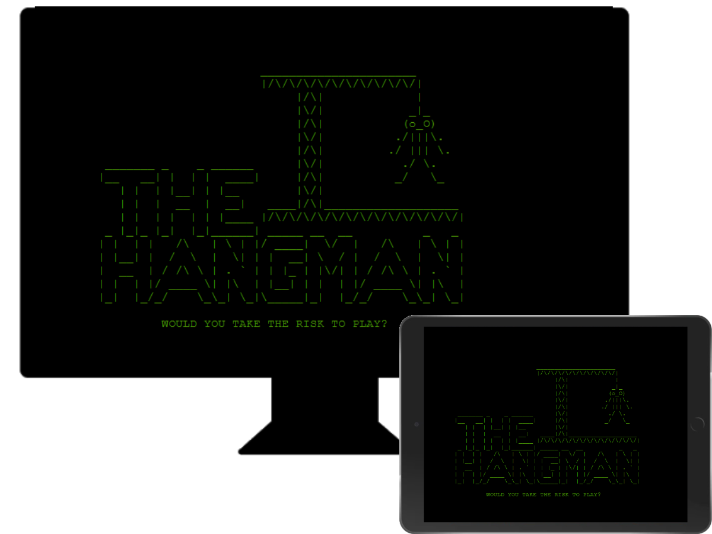

## README Table Content

* [Introduction](#introduction)
* [User Experience UX](#user-experience---UX)
* [Design](#Design)
    * [Flow](#Wireframe)
    * [Typography](#typography)
  
* [Features](#features)  
    * [Logo and Intro Message](#logo-and-intro-message) 
    * [Navigation Menu](#navigation-menu)
    * [Quiz Game 1 - Sports](#quiz-game-1---sports)
    * [Quiz Game 2 - History](#quiz-game-2---history)
    * [Quiz Game 3 - Geography](#quiz-game-3---geography)
    * [Game End Page](#game-end-page) 
    * [Trophy Gold Page](#trophy-gold-page)
    * [Trophy Silver Page](#trophy-silver-page)
    * [Trophy Bronze Page](#trophy-bronze-page)
    * [High Scores Page](#hign-scores-page)
* [Future Features](#future-features)
* [How to Play](#how-to-play)
* [Technologies Used](#technologies-used)
    * [Languages Used](#languages-used)
    * [Frameworks - Libraries - Programs Used](#frameworks---libraries---programs-used)
* [Testing](#testing)
* [Deployment](#deployment-this-project)
    * [Deployment This Project](#deployment-this-project)
    * [Forking This Project](#forking-this-project)
    * [Cloning This Project](#cloning-this-project)
* [Credits](#credits)
* [Content](#content)

## User Experience - UX

 ### User Stories

* As a website creator, I want to:
  
1. Build an easy app for the users to play the game.
2. Build a game that is both enjoyable and challenging for the players.
   
* As a new visitor, I want to:

1. Be able to understand the main purpose of the App and start a new game. 
2. Be able to follow along the score, wrong and right letters already guessed and the remaining of available tries while I am playing the game.
3. Be able to watch my results and other players results on the Leaderboard.
   
* As a returning visitor, I want to:

1. Be able to guess a different word choose by the computer. 
2. Be able to challenge myself and try to improve on my scores and compare with other users on the leaderboard
   
## Design

### Flow
In this project I decided to build a prototype using the tool Canva before starting work on the code. It was helpful from an UX perspective as I could display the different elements in the screen and work with them with the objective of building an application that would be easily used by the users. 
[Live Project Wireframe Here](https://cutt.ly/oIkZsAW)

#### Colour Scheme
 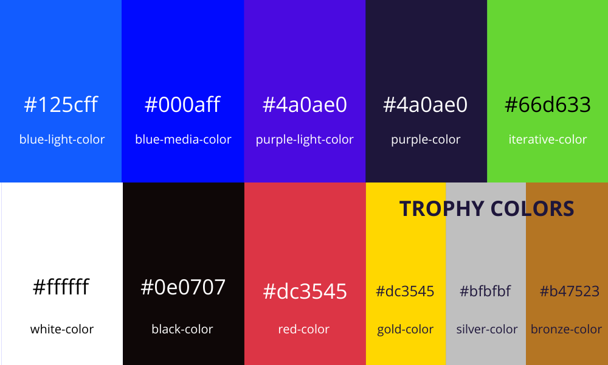 
 The main colour scheme I chose for this project is an overall blue tone and purple with a darker colour for maximum user accessibility. I have choosen a green color as an interactive-color to contrast with the background.

#### Typography
* The Arial is used as the main font for the whole website.
      
## Features

### Logo and Intro Message

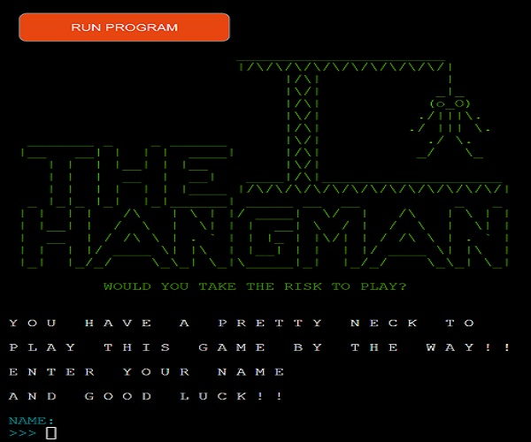

* When the users reach the website, they will see this feature where it will be displayed the game logo and the intro message. 

### Ask Player Name and City

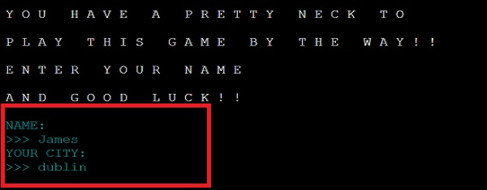
* After the player see the intro feature the computer will ask the user's name and city to be adding by input. 

#### Input for Name and City Empty
 
* If the player is trying to submit an empty input for name and city will see  this alert.

### Welcome Message and Game Rules
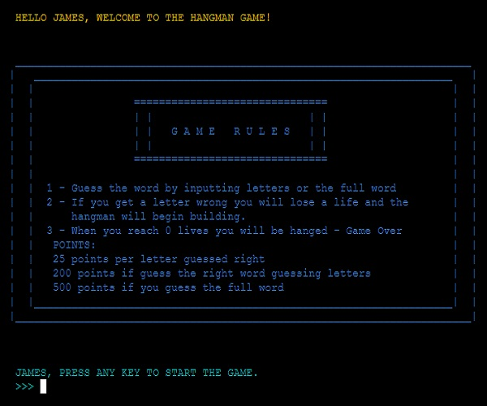
* After the user input the name and city the program will display to the player the welcome message and the game rules.

#### Navigation Menu Day/Night Mode
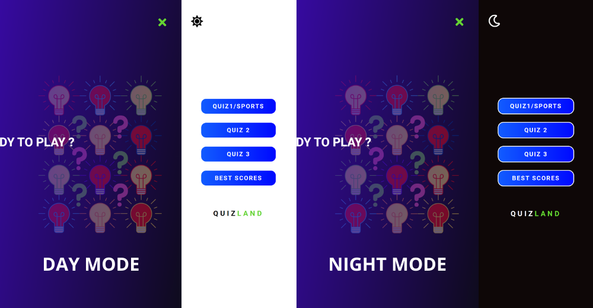
  * Menu Day/Night Mode. From 8am to 8pm users can access the navigation menu when open in day mode (background-color white), from 8pm to 8am users can access the same menu in night mode (background-color black).

### Quiz Game 1 - Sports

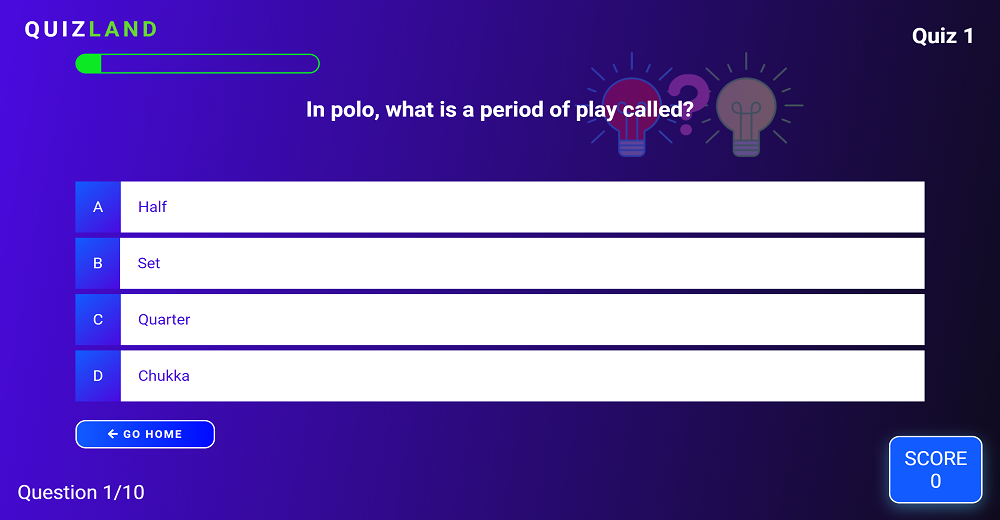
* All of the game happens in this feature. Here the users will see the questions and they have 4 choices as their answer. The player will choose one and will see if the answer given is right or wrong. 
The topic questions in Quiz 1 are Sports.  
[Live Page Here](https://pedrocristo.github.io/portfolio_project_2/pages/game-1.html)

### Quiz Game 2 - History

* This feature has the same purpose as Quiz 1 but here the topic questions are History.  
[Live Page Here](https://pedrocristo.github.io/portfolio_project_2/pages/game-2.html)

### Quiz Game 3 - Geography

* This feature has the same purpose as Quiz 1 and Quiz 2 but here the topic questions are Georaphy.  
[Live Page Here](https://pedrocristo.github.io/portfolio_project_2/pages/game-3.html)

### Game End Page

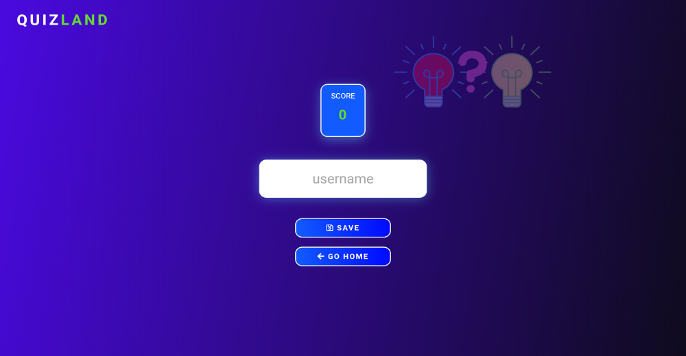

* Game End feature is the page that users go after a quiz is finished. Here the players can see the last score and save their usernames. 
[Live Feature Here](https://pedrocristo.github.io/portfolio_project_2/pages/game-end.html)

### Trophy Gold Page

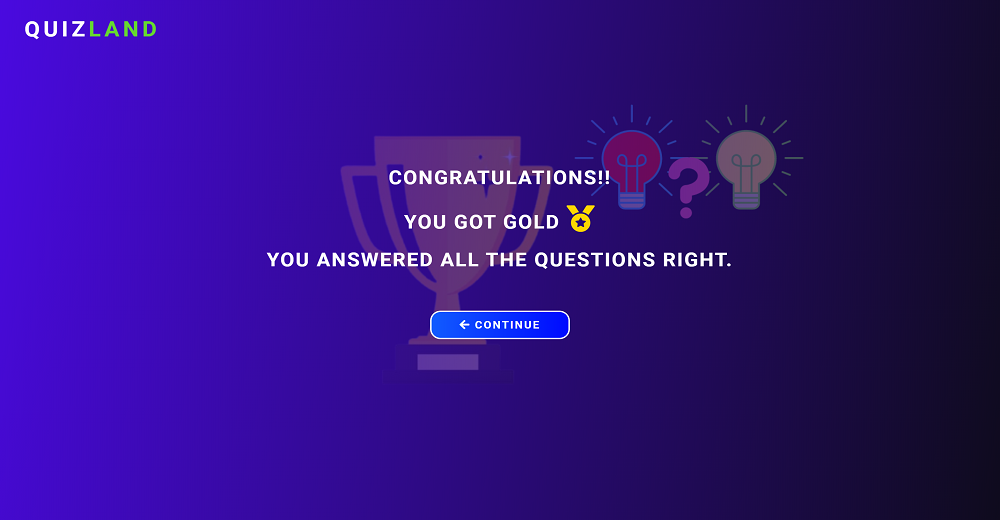

* After the user saves the game and if they score 250 they are brought to this feature to receive the gold medal. 
[Live Feature Here](https://pedrocristo.github.io/portfolio_project_2/pages/trophy-gold.html)

### Trophy Silver Page

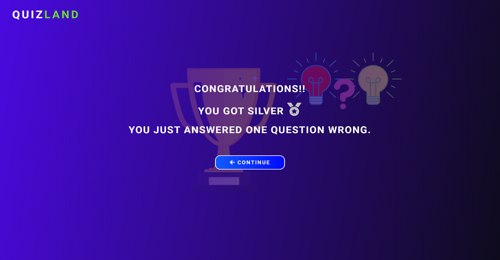

* After the user saves the game and if they score 225 they are brought to this feature to receive the silver medal. 
[Live Feature Here](https://pedrocristo.github.io/portfolio_project_2/pages/trophy-silver.html)

### Trophy Bronze Page

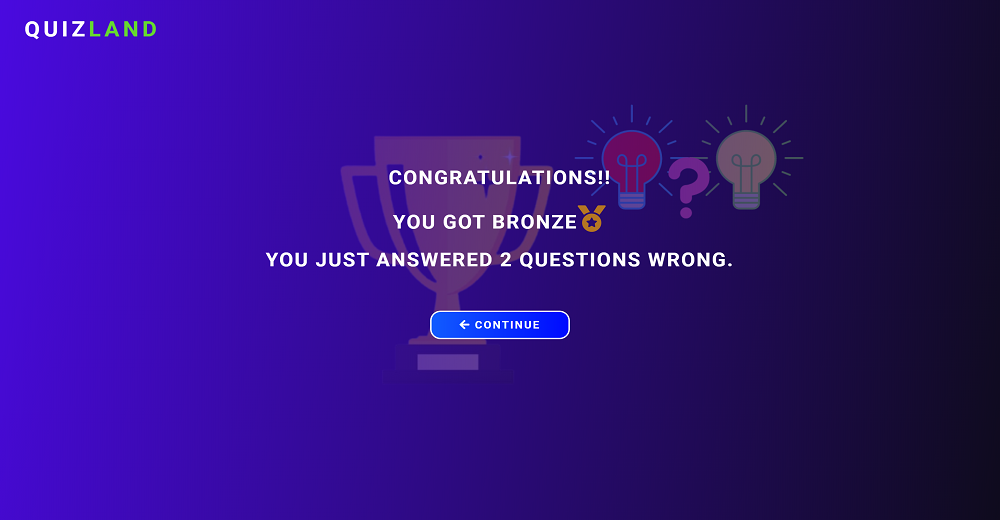

* After the user saves the game and if they score 200 they are brought to this feature to receive the bronze medal. 
[Live Feature Here](https://pedrocristo.github.io/portfolio_project_2/pages/trophy-bronze.html)

### High Scores Page

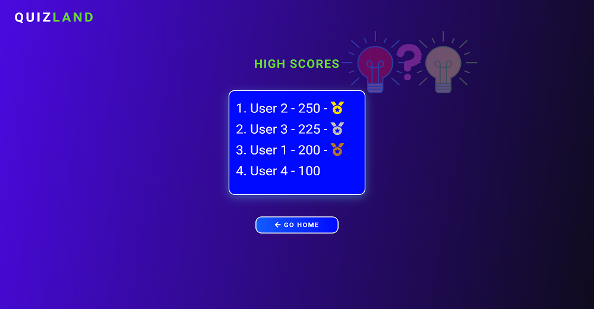

* In the High Scores feature users can check the best scores by the individual players. 
[Live Feature Here](https://pedrocristo.github.io/portfolio_project_2/pages/scores.html)

## Future Features
  
### Progress Bar Right/Wrong Answers

* I am planning to add a feature with two progress bars.  One progress bar to show the number of right answers and the other to show the number of wrong answers in the last game played.

## How To Play
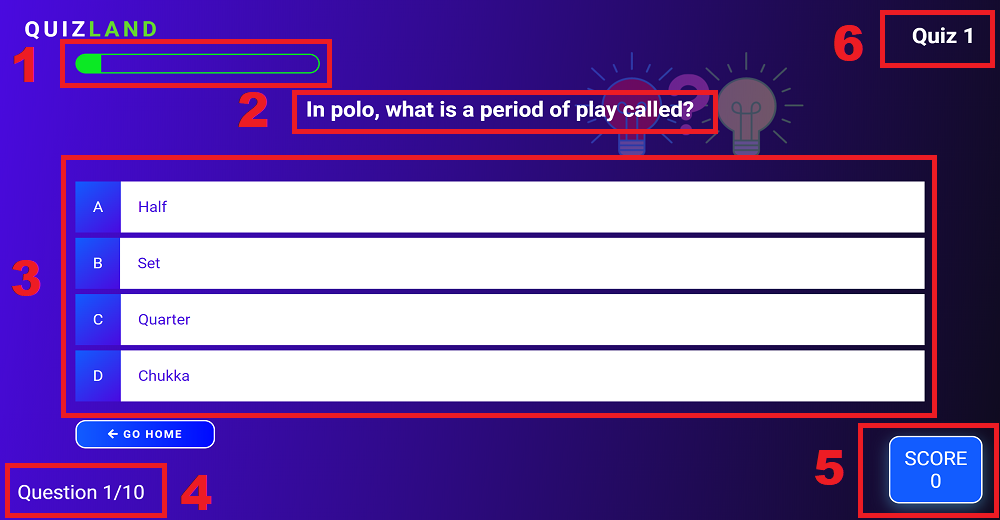
* The player has 3 different quizzes in the game. For each quiz the user will see the question on the top center [2] and 4 choices [3] are available.
The player then has to choose one of the choices and if the answer is right will win 25 points. The score will be displayed on the bottom right[5]. 
While the game is going on, users can see the progress bar updating any time they answer a question [1] and the question counter will also update on the bottom left [4] .
On the top right the users can check at any time what quiz they are on [6].

#### Right Answer
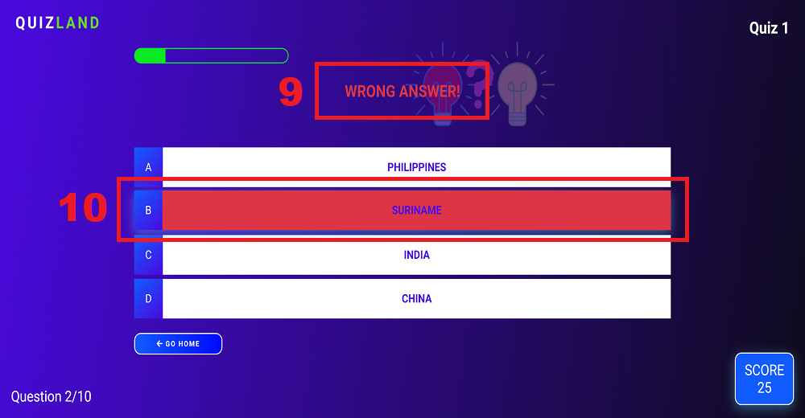
* When the user answers the question right the message "Right Answer" will appear on the top center [7] and the background color of their choice answer will turn green [8].

#### Wrong Answer

* When the user answers the question wrong the message "Wrong Answer" will appear on the top center [9] and the background color of their choice answer will turn red [10].

## Technologies Used

### Languages Used 

* [HTML5](https://en.wikipedia.org/wiki/HTML5)
* [CSS3](https://en.wikipedia.org/wiki/Cascading_Style_Sheets)
* [javaScript](https://www.javascript.com/)

### Frameworks - Libraries - Programs Used

* [Google Fonts](https://fonts.google.com/)
   * Google fonts were used to import the 'Roboto' font throughout the style.css.
* [Font Awesome](https://fontawesome.com/)
    * Font Awesome are used as an icons for user UX purposes.
* [Git](https://git-scm.com/)
    * Git was used for version control by utilizing the Gitpod terminal to commit to Git and Push to GitHub.
* [GitHub](https://github.com/)
    * GitHub is used to store the project's code after being pushed from Git.
* [VSCode](https://code.visualstudio.com/)
    * VSCode was used to create and edit the website.
* [Mobile Simulator](https://chrome.google.com/webstore/detail/mobile-simulator-responsi/ckejmhbmlajgoklhgbapkiccekfoccmk)
    * Mobile Simulater was used to test the website on a mobile device.
* [PIXLR](https://pixlr.com/pt/)
    * PIXLR was used to create, modify and resize all images on this website.
* [Canva](https://www)
   * Canva was used to create wireframe, the 3 background images and also the Favicon.
  
## Testing

The W3C Markup Validator and W3C CSS Validator Services were used to validate every page of the project to ensure there were no syntax errors in the project.

### [W3C Markup Validator](https://validator.w3.org)
#### Results:
* [HomePage](https://validator.w3.org/nu/?doc=https%3A%2F%2Fpedrocristo.github.io%2Fportfolio_project_2%2Findex.html)
* [Game 1](https://validator.w3.org/nu/?doc=https%3A%2F%2Fpedrocristo.github.io%2Fportfolio_project_2%2Fpages%2Fgame-1.html)
* [Game 2](https://validator.w3.org/nu/?doc=https%3A%2F%2Fpedrocristo.github.io%2Fportfolio_project_2%2Fpages%2Fgame-2.html)
* [Game 3](https://validator.w3.org/nu/?doc=https%3A%2F%2Fpedrocristo.github.io%2Fportfolio_project_2%2Fpages%2Fgame-3.html)
* [Game End](https://validator.w3.org/nu/?doc=https%3A%2F%2Fpedrocristo.github.io%2Fportfolio_project_2%2Fpages%2Fgame-end.html)
* [Trophy Gold](https://validator.w3.org/nu/?doc=https%3A%2F%2Fpedrocristo.github.io%2Fportfolio_project_2%2Fpages%2Ftrophy-gold.html)
* [Trophy Silver](https://validator.w3.org/nu/?doc=https%3A%2F%2Fpedrocristo.github.io%2Fportfolio_project_2%2Fpages%2Ftrophy-silver.html)
* [Trophy Bronze](https://validator.w3.org/nu/?doc=https%3A%2F%2Fpedrocristo.github.io%2Fportfolio_project_2%2Fpages%2Ftrophy-bronze.html)
* [High Scores](https://validator.w3.org/nu/?doc=https%3A%2F%2Fpedrocristo.github.io%2Fportfolio_project_2%2Fpages%2Fscores.html)
  

### [W3C CSS Validator](https://jigsaw.w3.org/css-validator) 
#### Results:
* [Main CSS](https://jigsaw.w3.org/css-validator/validator?uri=https%3A%2F%2Fpedrocristo.github.io%2Fportfolio_project_2%2Fassets%2Fcss%2Fmain.css&profile=css3svg&usermedium=all&warning=1&vextwarning=&lang=en)
* [Responsive CSS](https://jigsaw.w3.org/css-validator/validator?uri=https%3A%2F%2Fpedrocristo.github.io%2Fportfolio_project_2%2Fassets%2Fcss%2Fresponsive.css&profile=css3svg&usermedium=all&warning=1&vextwarning=&lang=en)

### [Jshint](https://jshint.com/)

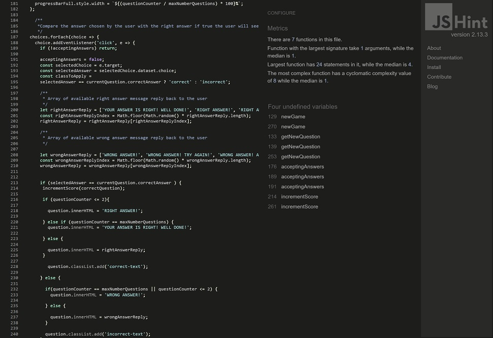.
  

The testing was done using the Google Chrome Browser. Chrome Developer Tools was used extensively, particularly to check responsiveness on different screen sizes. Testing was also done using Firefox on desktop, and again on Google Chrome and Opera on the Huawei P20.

* Responsive on all device sizes between 320px - 2600px wide

* Devices tested using the Google Developer Tools emulator

    * BlackBerry Z30 (360px x 640px)  
    * BlackBerry PlayBook (600px x 1024px)  
    * Samsung Galaxy Note 3 (360px x 640px) 
    * Samsung Galaxy S3 (360px x 640px) 
    * Samsung Galaxy S8 (360px x 740px)   
    * Samsung Galaxy S9+(320px x 658px) 
    * Samsung Galaxy Tab S4(712px x 1138px) 
    * LG Optimus L70 (384px x 640px)
    * Microsoft Lumia 550 (640px x 360px) 
    * Microsoft Lumia 950 (360px x 640px) 
    * Motorola G4 (360px x 640px)
    * Nexus 4 (384px x 640px) 
    * Nokia Lumia 520 (320px x 533px) 
    * Nokia N9 (480px x 854px) 
    * Pixel 3 (393px x 786px)
    * Apple iPad Mini (468px x 4024)
    * Apple iPhone 4 (320px x 480px)
    * Apple iPhone 5/S (320px 568px)
    * Apple iPhone 6/7/8 (375px x 667px)
    * Apple iPhone 6/7/8 Plus (414px x 736px)
    * Apple iPhone X (375px x 812px)
  
### Lighthouse 

 Lighthouse was used to test Performance, Best Practices, Accessibility and SEO on both Desktop and Mobile devices. 

* Desktop Results:

  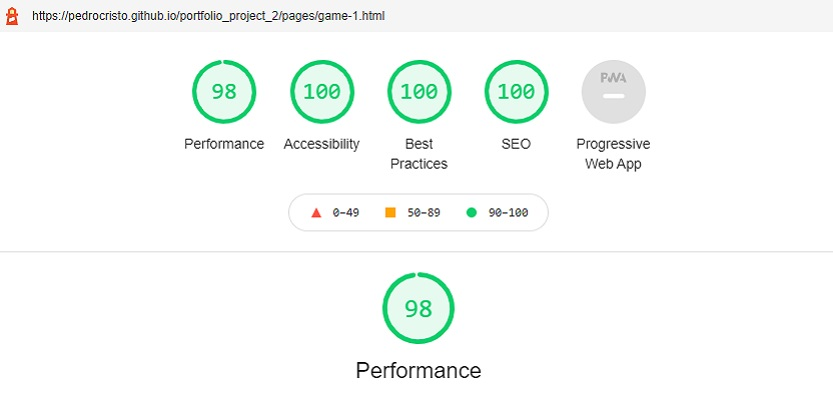.

* Mobile Results:

  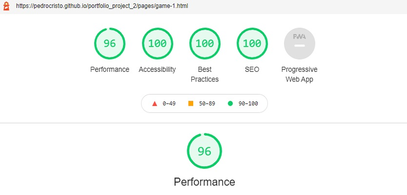.

## Functionality
* All links have been hovered and clicked to ensure accessibility.
* Pages all load correctly on all device screen sizes.
* All social media links work correctly and open a new tab.
* All the buttons are working correctly and bring the users to the function that they were built for.
* The game is working correctly the question comes at the right time and it gives a reply back to the user when answered. 
* The score has no issues and it increases by 25 points any time the user gives a right anwser. 
* The progress bar and question counter have also no issues, the background color increases (from 0% to 100%) and the number of questions also increases any time the user chooses an anwser.

## Bugs 
### Text Overlaping Mobile Devices
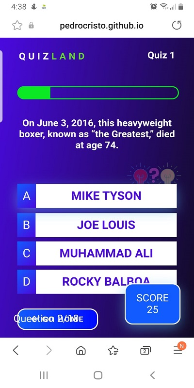
* I had this issue with my project when I built the layout for the Quiz Page as they are many elements in the same page. 

### Fix Bug
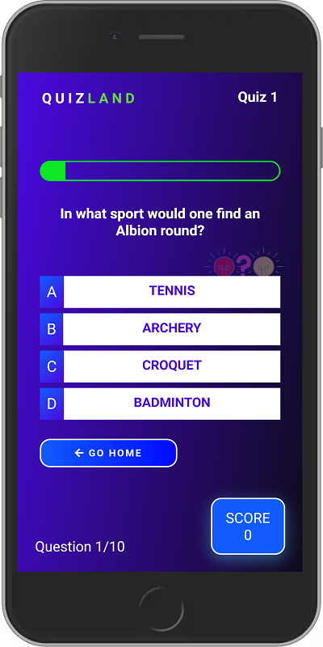
* I had to add media queries for portrait and landscape to avoid this issue happening. 

## Deployment of This Project

The website development was created in the "main" branch. This branch was deployed using GitHub Pages.

* This site was deployed by completing the following steps:

1. Open [GitHub](https://github.com/).
2. Click on the project to be deployed.
3. Navigate to the "Settings".
4. Navigate down to the "GitHub Pages".
5. Click on "Check it out here!".
6. Select the "main" branch and select "Save".
7. The link to the live website was ready on the top.

## Forking This Project

* Fork this project following the steps:
-
1. Open [GitHub](https://github.com/).
2. Click on the project to be forked.
3. Find the 'Fork' button at the top right of the page.
4. Once you click the button the fork will be in your repository..

## Cloning This Project

* Clone this project following the steps:

1. Open [GitHub](https://github.com/).
2. Click on the project to be cloned.
3. You will be provided with three options to choose from, HTTPS, SSH or GitHub CLI, click the clipboard icon in order to copy the URL.
4. Once you click the button the fork will be in your repository.
5. Open a new terminal.
6. Change the current working directory to the location that you want the cloned directory.
7. Type 'git clone' and paste the URL copied in step 3.
8. Press 'Enter' and the project is cloned.

## Credits

### Information Sources/Resources

* [W3Schools](https://www.w3schools.com/)

* [Stack Overflow](https://stackoverflow.com/)
  
* The JavaScript code for the Fancy Text Animation used in the Homepage was taken from the following tutorial: [Dev ED](https://www.youtube.com/watch?v=GUEB9FogoP8)

## Content

* All the questions provided in the game were taken from 2 online quizzes.
* [Lovatts & Puzzles](https://lovattspuzzles.com/).
* [Britannica Quiz](https://www.britannica.com/).

  
## Special Thanks

 * Special thanks to my mentor Sandeep Aggarwal, my colleagues at Code Institute, Kasia Bogucka and Mairéad Gillic for their assistance throughout this project.
