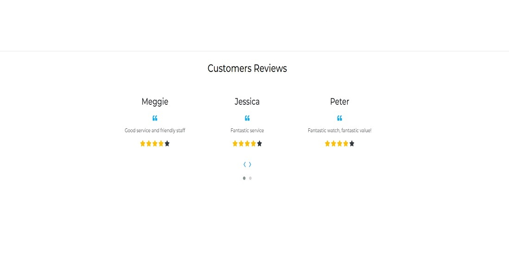

# Watches & Clocks - Introduction

Project milestone 5 for Code Institute Full-stack development program: Django Framework.
This project is a Full Stack E-commerce website built using the Django framework.
Watches & Clocks is an E-commerce shop where users can find and buy watches and search for
products by filtering different categories. They can also register themselves on the website
and fill in and keep their personal information on the profile page. All the visitors are welcome
to drop a service review and help the site admin to improve the service. The applicattion provides
a nice look, easy, clear and concise site navigation.

[Live Project Here](https://watches-and-clocks-portfolio-5.herokuapp.com/)

README Table Content

- [Watches \& Clocks - Introduction](#watches--clocks---introduction)
  - [User Experience - UX](#user-experience---ux)
    - [User Stories](#user-stories)
    - [Agile Methodology](#agile-methodology)
    - [The Scope](#the-scope)
      - [Main Site Goals](#main-site-goals)
  - [Design](#design)
      - [Colours](#colours)
      - [Typography](#typography)
      - [Imagery](#imagery)
      - [Video](#video)
    - [Wireframes](#wireframes)
  - [Database Diagram](#database-diagram)
  - [Features](#features)
    - [Landing Page](#landing-page)
    - [Home Page - Images Carousel](#home-page---images-carousel)
    - [Home Page - Selected Products](#home-page---selected-products)
    - [Home Page - Image Banner](#home-page---image-banner)
    - [Home Page - Customers Reviews Carousel](#home-page---customers-reviews-carousel)
    - [Products Page](#products-page)
    - [Products Details](#products-details)
    - [Products Details - Features](#products-details---features)
    - [Products Details - Products on Sale](#products-details---products-on-sale)
    - [Products Shopping Bag](#products-shopping-bag)
    - [Products Shopping Bag - Products Coming Soon](#products-shopping-bag---products-coming-soon)
    - [Products Checkout](#products-checkout)
    - [Products Checkout - Success](#products-checkout---success)
    - [Products Management](#products-management)
    - [Profile Page](#profile-page)
      - [Services Reviews Page](#services-reviews-page)
      - [Add/Edit Service Review Page](#addedit-service-review-page)
    - [Signup Page](#signup-page)
    - [Signup Page - Verify Email](#signup-page---verify-email)
    - [Signup Page - Confirm Email](#signup-page---confirm-email)
    - [Login Page](#login-page)
    - [Logout Page](#logout-page)
    - [Reset Password Page](#reset-password-page)
    - [Change Password Page](#change-password-page)
    - [Navbar](#navbar)
    - [Footer](#footer)
  - [Messages and Interaction With Users](#messages-and-interaction-with-users)
    - [Sign up 1](#sign-up-1)
    - [Sign up 2](#sign-up-2)
    - [Login](#login)
    - [Logout](#logout)
    - [Profile Update](#profile-update)
    - [Service Review - Add Review](#service-review---add-review)
    - [Service Review - Update Review 1](#service-review---update-review-1)
    - [Service Review - Update Review 2](#service-review---update-review-2)
    - [Service Review - Delete Review 1](#service-review---delete-review-1)
    - [Service Review - Delete Review 2](#service-review---delete-review-2)
    - [Service Review - Delete Review 3](#service-review---delete-review-3)
    - [Add Product](#add-product)
    - [Edit Product 1](#edit-product-1)
    - [Edit Product 2](#edit-product-2)
    - [Edit Product 3](#edit-product-3)
    - [Delete Product 1](#delete-product-1)
    - [Delete Product 2](#delete-product-2)
    - [Delete Product 3](#delete-product-3)
    - [Add Product to Bag](#add-product-to-bag)
    - [Update Bag](#update-bag)
    - [Remove Product from Bag](#remove-product-from-bag)
    - [Purchase Success](#purchase-success)
  - [Admin Panel / Superuser](#admin-panel--superuser)
  - [Marketing and Social Media](#marketing-and-social-media)
    - [Statista - Facebook Users](#statista---facebook-users)
    - [Watches \& Clocks - Facebook Page](#watches--clocks---facebook-page)
  - [Search Engine Optimization](#search-engine-optimization)
    - [sitemap.xml](#sitemapxml)
    - [robots.txt](#robotstxt)
    - [Sitemap Google Registration](#sitemap-google-registration)
  - [Technologies Used](#technologies-used)
    - [Languages Used](#languages-used)
      - [Django Packages](#django-packages)
    - [Frameworks - Libraries - Programs Used](#frameworks---libraries---programs-used)
    - [Testing](#testing)
  - [Creating the Django app](#creating-the-django-app)
  - [Deployment of This Project](#deployment-of-this-project)
  - [Final Deployment](#final-deployment)
  - [Forking This Project](#forking-this-project)
  - [Cloning This Project](#cloning-this-project)
  - [Credits](#credits)
    - [Content](#content)
    - [Information Sources / Resources](#information-sources--resources)
  - [Special Thanks](#special-thanks)

## User Experience - UX

### User Stories

- As a website user, I can:

1. Navigate around the site and easily view the desired content.
2. View a list of products and choose accordingly.
3. Search products to find specific poducts.
4. Click on a product to read the see the details.
5. Register for an account to avail of the services offered to members.
6. View comments on recipes so that I can read other users opinions.
7. Buy a product by using the website checkout

- As logged in website user, I can:

1. Review the website service.
2. Delete my previous reviews.
3. Edite my previous reviews.
4. Manage my profile by updating my details.
5. Logout from the website.
6. Buy a product by using the website checkout and using my saved data on my profile.

- As a website superuser, I can:

1. Create and publish a new product.
2. Create draft a new product so that come back and finished them later.
3. Create a new user, product, and categories.
4. Delete user, products, categories and reviews.
5. Approve user's reviews.
6. Change the website permissions for a user.
7. Upload new banners to be displayed on the website.

### Agile Methodology

All functionality and development of this project were managed using GitHub which Projects can be found
[here](https://github.com/PedroCristo/portfolio_project_5/issues)

### The Scope

#### Main Site Goals

- To provide users with a good experience when using the website with watches and clocks on display.
- To provide users with a visually pleasing website that is intuitive to use and easy to navigate.
- To provide a website with a clear purpose.
- To provide tools that allow users to search for products.
- To provide users with a easy and safe way to buy their products.

## Design

#### Colours

 

- The colour scheme is kept simple by opting for a combination of white text set against the image
  background and black text against the white background. The navbar was set on a white background
  and a light grey on the bottom. The interactive colour is used for icons and the website logo.
  Yellow and red are used for the buttons to buy and see product details. The dark grey for to website
  footer contrasts with the rest of the website.

#### Typography

- The Montserrat font is used as the main font for the whole project and the Kaushan font is used to
  display the website logo.

#### Imagery

- All the images, were converted to webp format to improve the website performance. The product images and
  banners are uploaded through the admin panel. The image banners are available in two different sizes to
  be displayed on desktop and mobile.

#### Video

- They are 2 videos playing as a background on the landing page, one is displaying on the desktop another one is on mobile.
  They were both compressed to improve the website's performance.

### Wireframes

Wireframes for this project can be located [here](WIREFRAMES.md)

## Database Diagram

 

## Features

### Landing Page

- This Landing page works as the website cover, users will see a background video playing in a loop, a slogan
  text about the collection available, two social media buttons and a button to go to the website's Home Page. 

### Home Page - Images Carousel

- The home page is equipped with a 3 images carousel on the top, users will see 3 banners advertising
  products and services provided by Watches & Clocks shop. 

### Home Page - Selected Products

- In this feature, users will see a selection of products selected by the website admin it can be used to highlight special
  or popular products. The website admin can choose the products to be displayed on this feature by selecting a product in
  the admin panel or from the website front-end and clicking on the featured box. 

### Home Page - Image Banner

- This banner feature is used to advertise new or popular products on the website. The website admin can upload many
  of them through the admin panel and choose the one to be displayed by clicking on the banner featured box. It allows
  the admin to change the banner easily depending on what will be better to be displayed at a certain moment. 

### Home Page - Customers Reviews Carousel

- In this feature, users can see a list of reviews written by other users about the website service. 
The website admin can choose the reviews to be displayed on this carousel by clicking the 
Carousel Review box in the admin panel. 

### Products Page

- On this page, users will see all the products available on the website such as some product details and if they are interested
in the watch they can press the button Buy Now. They can also sort products by price, name, rating and category. 
From this page, the site admin logged in can edit or delete products. 

### Products Details 

- This feature is at the top of the Product Details Page. Where users can see the product image and see information about the product 
such as price, category, gender category and rating. If they are interested in the watch they can choose the product size, and quantityand 
add the product to the shopping bag. Also, they can just leave the page by pressing the button Keep Shopping.

### Products Details - Features

- SScrolling down, the user will have access to the full product details such as watch features and watch details. 

### Products Details - Products on Sale

- In this features users, can see a selection of products on sales chosen by the website admin by adding an old price and 
changing the product status to sales on the admin panel or from the website front-end. 

### Products Shopping Bag

- This feature is the Shopping bag where users can add products, change the quantity or remove products, check total price and delivery
costs and go to the secure checkout to finish the order. They can also leave this page by pressing the button Kepp Shopping. 

### Products Shopping Bag - Products Coming Soon

- Scrolling down users can see a carousel displaying a selection of products that will be available for purchase on the website soon. 
The website admin can add products to this list by clicking the Coming Soon box in the admin panel or from the website front-end. 

### Products Checkout

- On the checkout page, users will have to fill out the form and add the credit/debit card details to finish the purchase. 

### Products Checkout - Success

- After a successful purchase, the user will be redirected to this page to check the confirmation of the order details. 

### Products Management

- On this page the website admin logged in can add a new product to the website without the need to go to the admin panel. 
  
### Profile Page

- On this page a user with a valid registration account and logged in can add or edit their own personal details and also check previous orders. 
  
#### Services Reviews Page

- On this page a user with a valid registration account and logged in can add or edit their own personal details and also check previous orders. 
  
#### Add/Edit Service Review Page

- On this page a user with a valid registration account and logged in can add or edit their own personal details and also check previous orders. 

### Signup Page

- On the Signup Page, a new user can sign up for the Watches & Closck website by filling out and then submitting the form. 
  
### Signup Page - Verify Email

- The user will be redirected to this page, after submitting the Signup form, telling them to check the link sent to the email box. 
  
### Signup Page - Confirm Email

- When the user will click on the link sent to the email box it will redirect the user to this page saying that the email is confirmed. 

### Login Page

- On the Login Page, users can log in to the website by inputting the username and password and have access
  to website services for a user registered. 

### Logout Page

- On the Logout Page, users can confirm that they wish to exit the website. 
  
### Reset Password Page

- Users can use this page to reset their login password by adding the email address in the input and clicking on the button Reset Password. 
  
### Change Password Page

- Users will get a link to reset their password and after clicking on the link it will redirect the user to this page where they can set a new password. 

### Navbar

- The navigation bar is present at the top of every page and houses all links to the various other pages.
- The links at the bottom of the navbar are dropdown menus. They are used to filter products such as all products, types of watches, gender and special offers. 
- Is available also a link to go to the Home Page and another one for more options.
- The options to Register or Log in will change to the option to log out once a user has logged in.
- Once a user has signed in, more options such as profile or add review will be available in the navbar.
- A search box is nested in also in the navbar.
- The navbar is fully responsive, collapsing into a hamburger menu when the screen size becomes smaller. 

### Footer

- On the website footer, users can see basic information about the Watches & Clocks such as contact, social media,
  copyright, and a form where they can subscribe to the newsletter. 

## Messages and Interaction With Users

- Some interactive messages were added to the project to make the navigation on the website easier and to improve the
  user's experience.

### Sign up 1

- When users sign up to the website they will see a message at the top right of the page saying "Confirmation e-mail sent to (email used to sign up)". 

### Sign up 2

- User have to confirm the email used for signing up and will see at the top right of the page the following message "You have confirmed (email used to sign up)". 

### Login

- When users sign in to the website they will see a message at the top right of the page saying "Successfully signed in as
  (username)". 

### Logout

- When users log out of the website they will see a message at the top right of the page saying "You have signed out". 

### Profile Update

- When users update their profile they will see a message at the top right of the page saying that their account has been updated. 

### Service Review - Add Review

- When users are logged in to the website they can add a service review and after they submit the review they will see a
  message at the top right of the page saying "Your review was sent successfully and is awaiting approval". 

### Service Review - Update Review 1

- When users are logged in to the website and they have previously posted a review they will see the Edit
button at the bottom of their reviews  

### Service Review - Update Review 2

- After the review is updated the user will see the message at the top right of the screen saying "The review was successfully updated".  

### Service Review - Delete Review 1 

- When users are logged in to the website and they have previously posted a review they will see the Delete
button at the bottom of their reviews. 

### Service Review - Delete Review 2

- If they wish to delete their review, they can press the button Delete and a Bootstrap box model will pop up with the message
  "Are you sure you want to delete your review?". 

### Service Review - Delete Review 3

- After pressing the Delete button again inside the Bootstrap box model they will see a message at the
  top right of the page, "The review was deleted successfully". 

### Add Product

- The website admin logged in can add new products through the website's front-end. After it will be submitted successfully the following
message pops up at the top right of the page "Successfully added product". 

### Edit Product 1

- The website admin logged in can edit products already added through the website's front-end by clicking on the Edit button. 

### Edit Product 2

- Once the button is clicked the website admin will see the following alert at the top right of the screen "You are editing (product name)". 

### Edit Product 3

- After the Update Product button is pressed and the product is edited successfully the website admin will see a message at the top right of the page 
"Successfully updated product!". 

### Delete Product 1

- The website admin logged in can delete products already added through the website's front-end by clicking on the Delete button. 

### Delete Product 2

- After pressing the Delete button the Bootstrap box model will pop up with a message at the
  center of the page, "Are you sure you want to delete this product?". 

### Delete Product 3

- After pressing the Delete button again inside the Bootstrap box model they will see a message at the
  top right of the page, "Product deleted". 

### Add Product to Bag

- When users choose a product and add it to the bag they will see a success message at the top right of the screen. 

### Update Bag

- When users update the bag they will see a success message at the top right of the screen.. 

### Remove Product from Bag

- When users remove the products from the bag they will see a success message at the top right of the screen. 

### Purchase Success

- When users fill out the check-out form and finish the purchase successfully they will see a success message 
with the order details at the top right of the screen.. 

## Admin Panel / Superuser

- On the Admin Panel, as an admin/superuser I have full access to CRUD functionality so I can view, create, edit and
  delete the following apps:

1. Banners
2. Checkout
3. Products
4. Profiles
5. Reviews

- As admin/superuser I can also approve reviews and change the status and give other permissions to the users. 

## Marketing and Social Media

- Market research was performed to decide on the marketing strategy needed to promote the Watches & Clocks brand. For social media marketing, 
Facebook is still the best option to promote brands to potential customers as it is one of the most used social media also 22% of users are 
aged between 18 - 24 and 31% of users are aged between 25 - 34. This amount of users are the main target for Watches & Clocks potential customers. 

### Statista - Facebook Users

- Distribution of Facebook users worldwide as of 2022 according to [Statista](https://www.statista.com/) 
  
### Watches & Clocks - Facebook Page

 - [Watches & Clocks Facebook Page](https://www.facebook.com/people/Watches-Clocks/100086385370740/) 

## Search Engine Optimization

### sitemap.xml

- A sitemap file with a list of important URLs was added to ensure that search engines are able to easily navigate through the site 
and understand its structure. This was made using XML-sitemaps.com by following the steps:

1. Paste the URL of the deployed site into XML-sitemaps
2. Download the XML sitemap file once ready
3. Add the file into the projects root folder, named as sitemap.xml

### robots.txt

- A robots.txt file was created to tell search engines where not to go on the website and increase the quality of the site, ultimately improving the SEO rating. 

### Sitemap Google Registration

- To ensure that the Google engine will check the website sitemap file I have registered the Watches & Clocks URL on the Google Search Console. 

## Technologies Used

### Languages Used

- [HTML 5](https://en.wikipedia.org/wiki/HTML/)
- [CSS 3](https://en.wikipedia.org/wiki/CSS)
- [JavaScript](https://www.javascript.com/)
- [Django](https://www.python.org/)
- [Python](https://www.djangoproject.com/)

#### Django Packages

- [Gunicorn](https://gunicorn.org/) as the server for Heroku
- [Dj_database_url](https://pypi.org/project/dj-database-url/) to parse the database URL from the environment variables in Heroku
- [Psycopg2](https://pypi.org/project/psycopg2/) as an adaptor for Python and PostgreSQL databases
- [Summernote](https://summernote.org/) as a text editor
- [Allauth](https://django-allauth.readthedocs.io/en/latest/installation.html) for authentication, registration, account management
- [Stripe](https://pypi.org/project/stripe/) for processing all purchases on the website
- [Crispy Forms](https://django-crispy-forms.readthedocs.io/en/latest/) to style the forms
- [Pillow](https://pypi.org/project/Pillow/) to process and save all the images downloaded through the database

### Frameworks - Libraries - Programs Used

- [Bootstrap](https://getbootstrap.com/)
- Was used to style the website, add responsiveness and interactivity
- [Jquery](https://jquery.com/)
- All the scripts were written using jquery library
- [Git](https://git-scm.com/)
- Git was used for version control by utilizing the Gitpod terminal to commit to Git and push to GitHub
- [GitHub](https://github.com/)
- GitHub is used to store the project's code after being pushed from Git
- [Heroku](https://id.heroku.com)
- Heroku was used to deploy the live project
- [PostgreSQL](https://www.postgresql.org/)
- Database used through heroku.
- [VSCode](https://code.visualstudio.com/)
- VSCode was used to create and edit the website
- [Lucidchart](https://lucid.app/)
- Lucidchart was used to create the database diagram
- [PEP8](http://pep8online.com/)
- PEP8 was used to validate all the Python code
- [W3C - HTML](https://validator.w3.org/)
- W3C- HTML was used to validate all the HTML code
- [W3C - CSS](https://jigsaw.w3.org/css-validator/)
- W3C - CSS was used to validate the CSS code
- [Fontawesome](https://fontawesome.com/)
- To add icons to the website
- [Google Chrome Dev Tools](https://developer.chrome.com/docs/devtools/)
- To check App responsiveness and debugging
- [Google Fonts](https://fonts.google.com/)
- To add the 2 fonts that were used throughout the project
- [Balsamiq](https://balsamiq.com/)
- To build the wireframes for the project
- [PIXLR](https://pixlr.com)
- To convert the images to webp format
- [CANVA](https://www.canva.com/)
- To build the logos for the project
- [AWS](https://aws.amazon.com/) 
- was used to host the static files and media

### Testing

Testing results [here](TESTING.md)

## Creating the Django app

1. Go to the Code Institute Gitpod Full Template [Template](https://github.com/Code-Institute-Org/gitpod-full-template)
2. Click on Use This Template
3. Once the template is available in your repository click on Gitpod
4. When the image for the template and the Gitpod are ready open a new terminal to start a new Django App
5. Install Django and gunicorn: pip3 install django gunicorn
6. Install supporting database libraries dj_database_url and psycopg2 library: pip3 install dj_database_url psycopg2
7. Create file for requirements: in the terminal window type pip freeze --local > requirements.txt
8. Create project: in the terminal window type django-admin startproject your_project_name
9. Create app: in the terminal window type python3 manage.py startapp your_app_name
10. Add app to the list of installed apps in settings.py file: you_app_name
11. Migrate changes: in the terminal window type python3 manage.py migrate
12. Run the server to test if the app is installed, in the terminal window type python3 manage.py runserver
13. If the app has been installed correctly the window will display The install worked successfully! Congratulations!

## Deployment of This Project

- This site was deployed by completing the following steps:

1. Log in to [Heroku](https://id.heroku.com) or create an account
2. On the main page click the button labelled New in the top right corner and from the drop-down menu select Create New
   App
3. You must enter a unique app name
4. Next select your region
5. Click on the Create App button
6. Click in resources and select Heroku Postgres database
7. Click Reveal Config Vars and add a new record with SECRET_KEY
8. Click Reveal Config Vars and add a new record with the AWS_ACCESS_KEY_ID
9. Click Reveal Config Vars and add a new record with the AWS_SECRET_ACCESS_KEY
10. Click Reveal Config Vars and add a new record with the EMAIL_HOST_PASS
11. Click Reveal Config Vars and add a new record with the EMAIL_HOST_USER
12. Click Reveal Config Vars and add a new record with the STRIPE_PUBLIC_KEY
13. Click Reveal Config Vars and add a new record with the STRIPE_SECRET_KEY
13. Click Reveal Config Vars and add a new record with the STRIPE_WH_SECRET
10. Click Reveal Config Vars and add a new record with the DISABLE_COLLECTSTATIC = 1
11. The next page is the project’s Deploy Tab. Click on the Settings Tab and scroll down to Config Vars
12. Next, scroll down to the Buildpack section click Add Buildpack select python and click Save Changes
13. Scroll to the top of the page and choose the Deploy tab
14. Select Github as the deployment method
15. Confirm you want to connect to GitHub
16. Search for the repository name and click the connect button
17. Scroll to the bottom of the deploy page and select the preferred deployment type
18. Click either Enable Automatic Deploys for automatic deployment when you push updates to Github

## Final Deployment

1. Create a runtime.txt "python-3.9.13"
2. Create a Procfile "web: gunicorn your_project_name.wsgi"
3. When development is complete change the debug setting to: DEBUG = False in settings.py
4. In this project the summernote editor was used so for this to work in Heroku add: X_FRAME_OPTIONS = 'SAMEORIGIN' to
   settings.py.
5. In Heroku settings config vars delete the record for DISABLE_COLLECTSTATIC
6. In Heroku settings config vars set the record for USE_AWS to True
  

## Forking This Project

- Fork this project by following the steps:

1. Open [GitHub](https://github.com/PedroCristo/portfolio_project_5)
2. Find the 'Fork' button at the top right of the page
3. Once you click the button the fork will be in your repository

## Cloning This Project

- Clone this project by following the steps:

1. Open [GitHub](https://github.com/PedroCristo/portfolio_project_5)
2. You will be provided with three options to choose from, HTTPS, SSH or GitHub CLI, click the clipboard icon in order
   to copy the URL
3. Once you click the button the fork will be in your repository
4. Open a new terminal
5. Change the current working directory to the location that you want the cloned directory
6. Type 'git clone' and paste the URL copied in step 3
7. Press 'Enter' and the project is cloned

## Credits

### Content

- All the products content were taken from [Amazon](https://www.amazon.com/)
- The images were taken from [Aliexpress](https://www.aliexpress.com/)
- The 2 videos used as a background on the Landing Page were taken from [Pexels](https://www.pexels.com/)
- The Watches & Clocks logos and favicon are my own designed and build

### Information Sources / Resources

- [W3Schools - Python](https://www.w3schools.com/python/)
- [Stack Overflow](https://stackoverflow.com/)
- [Scrimba - Pyhton](https://scrimba.com/learn/python)
- [Code Institute - Slack Community](https://slack.com/)

## Special Thanks

- Special thanks to my mentor Sandeep Aggarwal, my colleagues at Code Institute, Kasia Bogucka, and Mairéad Gillic for
  their assistance throughout this project.
