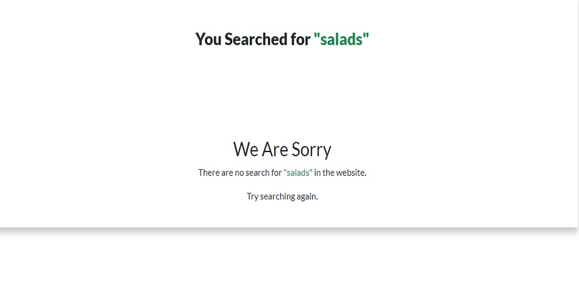
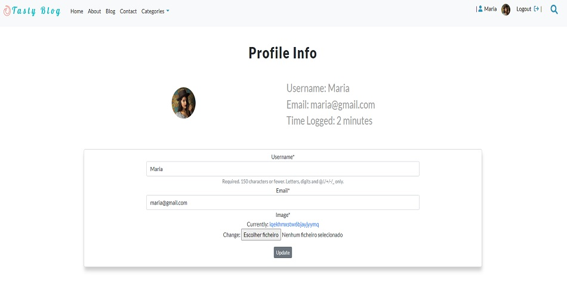
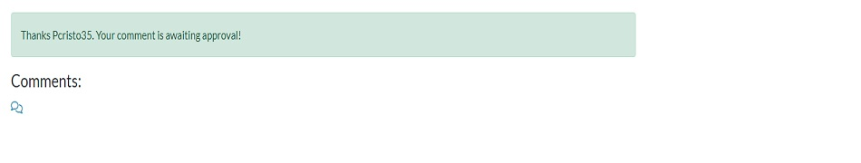
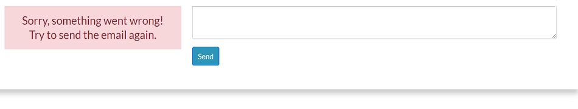
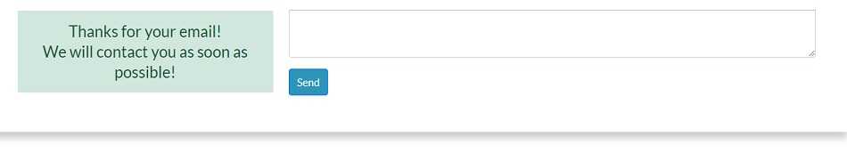

# Tasty Blog

# Introduction
Project milestone 4 for Code Institute Full-stack development program: Django Framework.
This project is a Full Stack website built using the Django framework. Tasty Blog is a recipe book where users can look or search for a recipe to prepare and if they are login they can also like/unlike, comment on a post and upload or update their user image and details. As a user admin, they can post new recipes, approve comments and add new authors.

[Live Project Here](https://tasty-blog-portfolio-project-4.herokuapp.com/)

## README Table Content

- [Tasty Blog](#tasty-blog)
- [Introduction](#introduction)
  - [README Table Content](#readme-table-content)
  - [User Experience - UX](#user-experience---ux)
    - [User Stories](#user-stories)
  - [Design](#design)
      - [Colours](#colours)
      - [Typography](#typography)
      - [Imagery](#imagery)
    - [Wireframes](#wireframes)
  - [Database Diagrama](#database-diagrama)
  - [Features](#features)
    - [Home Page](#home-page)
    - [Home Page - Highilights Posts](#home-page---highilights-posts)
      - [About Page](#about-page)
    - [Blog Page](#blog-page)
    - [Post Detail Page - Top](#post-detail-page---top)
    - [Post Detail Page - Steps](#post-detail-page---steps)
    - [Post Detail Page - Comments](#post-detail-page---comments)
    - [Contact Page](#contact-page)
    - [Categories Page](#categories-page)
    - [Categories **Results**](#categories-results)
    - [Search Page](#search-page)
    - [Search Results Page](#search-results-page)
    - [Search Results - Input Empty](#search-results---input-empty)
    - [Search Results - No Results Found](#search-results---no-results-found)
    - [Signup Page](#signup-page)
    - [Login Page](#login-page)
    - [Logout Page](#logout-page)
    - [User Profile Page](#user-profile-page)
    - [Navbar](#navbar)
    - [Footer](#footer)
    - [Messages and Interaction With Users](#messages-and-interaction-with-users)
  - [Technologies Used](#technologies-used)
    - [Languages Used](#languages-used)
      - [Django Packages](#django-packages)
    - [Frameworks - Libraries - Programs Used](#frameworks---libraries---programs-used)
    - [Testing](#testing)
  - [Creating the Django app](#creating-the-django-app)
  - [Deployment of This Project](#deployment-of-this-project)
  - [Final Deployemt](#final-deployemt)
  - [Forking This Project](#forking-this-project)
  - [Cloning This Project](#cloning-this-project)
  - [Credits](#credits)
    - [Content](#content)
    - [Information Sources / Resources](#information-sources--resources)
  - [Special Thanks](#special-thanks)

## User Experience - UX

### User Stories
A list of my user stories and their tasks can be found
[here](https://github.com/PedroCristo/portfolio_project_4/issues)

* As a website user, I can:
1. Navigate around the site so that I can easily view desired content.
2. View a list of recipes so that I can choose one to read.
3. Search recipes so that I can find specific recipes I'm looking for.
4. Click on a recipe so that I can read the recipe details.
5. Register for an account so that I can begin to use the services afforded to members

* As website user login, I can:
1. Like/unlike recipes so that I can mark which recipes I enjoyed.
2. View the number of likes on a recipe so that I can see which is most popular.
3. View comments on recipes so that I can read other user's opinions.
4. Comment on recipes so that I can give my opiniom about the posts.
5. log in/out so that I can like recipes, comment on recipes and manage my profile.
  
## Design

#### Colours
* The colours in the game are supplied by the Python Colorama Model

#### Typography
* The Lato font is used as the main font for the whole project  and the Kaushan font is used to show the word enjoy in the Post Details and About pages.
  
#### Imagery
* All the imagery will be related to recipes and website design with only 7 images being static. The rest will be uploaded by the author in the database.

### Wireframes
Wireframes for this project [here](WIREFRAMES.md)

## Database Diagrama
 

## Features

### Home Page

* The hero image welcomes the user with a short message advertising what the website is about. These are 3 images of a carousel with a button that once is pressed brings the user down to the highlighted recipes. 

### Home Page - Highilights Posts

* In the highlighted posts, users can watch a selection of 6 recipes, chosen by the site admin by clicking the featured box in the post database. 

#### About Page

* On the About Page, users can read information about the Tasty Blog website as the main purpose and the main goal of the blog. This is basically a way to introduce the website to the users. 

### Blog Page

* On the Blog Page, users can have access to the whole recipes posts available on the website and choose anyone to see the recipe detail by clicking on the card. 
  
### Post Detail Page - Top

* At the top of the Post Details Page, users can see the post's main image and have access to information about the post such as category, recipe name, rating stars, time to prepare, author name and image, and posted date, like unlike the post and how many likes and comments. 
  
### Post Detail Page - Steps

* In this page section, users can read the ingredients and follow the steps to conclude the recipe. 
  
### Post Detail Page - Comments

* At the bottom of this page, users can read the comments posted by other users and if they are login they are allowed to comment and delete comments posted by themselves. 

### Contact Page
  
* On the Contact Page, users can have access to the Tasty blog contact and also send an email by sending a contact form available on this page.

### Categories Page
  
* On the Categories Page, users can see the categories available in the blog and filter the posts by category.

### Categories **Results**

* On the Categories Results Page, users can access to the post filtered by the category chosen.

### Search Page

* In this box, the users can do a search by inputting a keyword in the input and trying to find the recipe they are looking for.
  
### Search Results Page

* On the Search Results Page, users can see the recipes found by their search and go to the Post Details Page by clicking on the card result.
  
### Search Results - Input Empty

* On the Search Results Page - Input Empty, users will see this message if they do a search with an empty input.
  
### Search Results - No Results Found

* On the Search Results Page - No Results Found, users will see this message if there is nothing found for the search.
  
### Signup Page

* On the Signup Page, a new user can sign up for the Tasty Blog website by filling out the form and submit.
  
### Login Page

* On the Login Page, users can log in to the website and have access to their Profile Page, upload a user image, comment on a post, delete a comment and like/unlike a recipe.
  
### Logout Page

* 3O the Logout Page, users can confirm that they wanna exit the website.
  
### User Profile Page

* On the Profile Page, users can have access to their own information and update their user name, email and profile image.
  
### Navbar

* The navigation bar is present at the top of every page and houses all links to the various other pages.
* The options to Register or Log in will change to the option to log out once a user has logged in.
* Once a user has signed in, more options such as profile page and user image will be available in the navbar.
* A search icon is nested in the navbar and once clicked it will open the search box.
* The navbar is fully responsive, collapsing into a hamburger menu when the screen size becomes smaller.
  
### Footer

*On the website footer, users can see basic information about the blog such as contact, social media, copyright, and quote about food recipes.

### Messages and Interaction With Users
* Some interactive messages were added to the project to make the navigation on the website easier and to improve the user's experience.

* When users sign in to the website they will see a message at the top of the page saying "Successfully signed in as (username)". 

* TWhen users sign in to the website they will see a message at the top of the page saying "Successfully signed in as (username)".. 

* When users log out of the website they will see a message at the top of the page saying "You have signed out". 

* When users update their profile they will see a message at the top of the page saying that the account has been updated. 
  

*When users logged in to the website they can like a post and they will see a message at the top of the page saying "You have liked this post". 
  

* When users logged in to the website they can unlike a post that has been liked by the user and they will see a message at the top of the page saying "You have unliked this post". 
  

* When users logged in to the website they can comment on a post and after they submit the comment they will see a message at the top of the page saying "Your comment was sent successfully and is awaiting approval". 
  

* Also, they will see a message over the input comment, after they submit a comment, saying "Thanks (username). Your comment is awaiting approval!. 
  

* When users logged in to the website and they have posted already a comment they will see the button Delete at the bottom of their comments. 
  

* If they wanna delete their comment they can press the button Delete and a Bootstrap box model will pop up with the message "Are you sure you want to delete your comment?". . 
  

* After pressing the button Delete again inside the Bootstrap box model they will see a message on the top of the page, "Your comment was deleted successfully". 
  

* Any user can send a message using the contact form on the Contact page and they will see the message on the top of the page saying, "Your email has been sent". 
  

* After pressing the button Send to submit the massage they will also see the message, "Thanks for your email (username). We will contact you as soon as possible", next to the contact form. 

* TAny user can search for a keyword using the input search and if the search is done with an empty input they will see a message saying, "You forgot to search a recipe. Please try searching again.". 
  

* TAnd if there are no results found relative to the keyword, the user will see the following message, "We are sorry. There are no searches for (keyword) on the website. Try the search again". 

## Technologies Used
### Languages Used 

* [HTML 5](https://en.wikipedia.org/wiki/HTML/)
* [CSS 3](https://en.wikipedia.org/wiki/CSS)
* [JavaScript](https://www.javascript.com/)
* [Django](https://www.python.org/)
* [Python](https://www.djangoproject.com/)

#### Django Packages

* [Gunicorn](https://gunicorn.org/) as the server for Heroku
* [Cloudinary](https://cloudinary.com/) was used to host the static files and media
* [Dj_database_url](https://pypi.org/project/dj-database-url/) to parse the database URL from the environment variables in Heroku
* [Psycopg2](https://pypi.org/project/psycopg2/) as an adaptor for Python and PostgreSQL databases
* [Summernote](https://summernote.org/) as a text editor
* [Allauth](https://django-allauth.readthedocs.io/en/latest/installation.html) for authentication, registration, account management
* [Crispy Forms](https://django-crispy-forms.readthedocs.io/en/latest/) to style the forms
  
### Frameworks - Libraries - Programs Used

* [Bootstrap](https://getbootstrap.com/)
    * Was used to style the website, add responsiveness and interactivity
* [Jquery](https://jquery.com/)
    * All the scripts were written using jquery library
* [Git](https://git-scm.com/)
    * Git was used for version control by utilizing the Gitpod terminal to commit to Git and push to GitHub
* [GitHub](https://github.com/)
    * GitHub is used to store the project's code after being pushed from Git
* [Heroku](https://id.heroku.com)
    * Heroku was used to deploy the live project
* [PostgreSQL](https://www.postgresql.org/)
    * Database used through heroku.
* [VSCode](https://code.visualstudio.com/)
    * VSCode was used to create and edit the website
* [Lucidchart](https://lucid.app/)
    * Lucidchart was used to create the database diagrama
* [PEP8](http://pep8online.com/)
    * PEP8 was used to validate all the Python code
* [W3C - HTML](https://validator.w3.org/](https://validator.w3.org/))
    * W3C- HTML was used to validate all the HTML code
* [W3C - CSS](https://jigsaw.w3.org/css-validator/)
    * W3C - CSS was used to validate the CSS code
* [Fontawesome](https://fontawesome.com/)
    * To add icons to the website
* [Google Chrome Dev Tools](https://developer.chrome.com/docs/devtools/)
    *  To check reponsiveness and contrast and JS errors in the console
* [Google Fonts](https://fonts.google.com/)
    * To add the 2 fonts using in the project
* [Balsamiq](https://balsamiq.com/)
    * To build the wireframes for the project
* [PIXLR](https://pixlr.com)
    * To convert the images to webp format
* [CANVA](https://www.canva.com/)
    * To build the the logos for the project

### Testing
Testing results [here](TESTING.md)
  
## Creating the Django app
* Go the the Code Institute Gitpod Full Template [Template](https://github.com/Code-Institute-Org/gitpod-full-template)
* Clik on Use This Template
* Once the template is available in your repository click on Gitpod
* When the image for the template and the Gitpod are ready open a new terminal to start a new Django App
* Install Django and gunicorn: pip3 install django gunicorn
* Install supporting database libraries dj_database_url and psycopg2 library: pip3 install dj_database_url psycopg2
* Create file for requirements: in the terminal window type pip freeze --local > requirements.txt
* Create project: in the terminal window type django-admin startproject your_project_name 
* Create app: in the terminal window type python3 manage.py startapp your_app_name
* Add app to the list of installed apps in settings.py file: you_app_name
* Migrate changes: in the terminal window type python3 manage.py migrate
* Run the server to test if the app is installed, in the terminal window type python3 manage.py runserver
* If the app has been installed correctly the window will display The install worked successfully! Congratulations!
## Deployment of This Project

* This site was deployed by completing the following steps:

1. Log in to [Heroku](https://id.heroku.com) or create an account
2. On the main page click the button labelled New in the top right corner and from the drop-down menu select Create New App
3. You must enter a unique app name
4. Next select your region
5. Click on the Create App button
6. Click in resources and select Heroku Postgres database
7. Click Reveal Config Vars and add a new record with SECRET_KEY
8. Click Reveal Config Vars and add a new record with the CLOUDINARY_URL
9. Click Reveal Config Vars and add a new record with the DISABLE_COLLECTSTATIC = 1
10. The next page is the project’s Deploy Tab. Click on the Settings Tab and scroll down to Config Vars
11. Next, scroll down to the Buildpack section click Add Buildpack select python and click Save Changes
12. Scroll to the top of the page and choose the Deploy tab
13. Select Github as the deployment method
14. Confirm you want to connect to GitHub
15. Search for the repository name and click the connect button
16. Scroll to the bottom of the deploy page and select the preferred deployment type
17. Click either Enable Automatic Deploys for automatic deployment when you push updates to Github

## Final Deployemt
1. Create a runtime.txt "python-3.8.13"
2. Create a Procfile "web: gunicorn your_project_name.wsgi"
3. When development is complete change the debug setting to: DEBUG = False in settings.py
4. In this project the summernote editor was used so for this to work in Heroku add: X_FRAME_OPTIONS = 'SAMEORIGIN' to settings.py.
5. In Heroku settings config vars delete the record for DISABLE_COLLECTSTATIC

## Forking This Project

* Fork this project by following the steps:

1. Open [GitHub](https://github.com/PedroCristo/portfolio_project_4)
2. Find the 'Fork' button at the top right of the page
3. Once you click the button the fork will be in your repository

## Cloning This Project

* Clone this project by following the steps:
  
1. Open [GitHub](https://github.com/PedroCristo/portfolio_project_4)
2. You will be provided with three options to choose from, HTTPS, SSH or GitHub CLI, click the clipboard icon in order to copy the URL
3. Once you click the button the fork will be in your repository
4. Open a new terminal
5. Change the current working directory to the location that you want the cloned directory
6. Type 'git clone' and paste the URL copied in step 3
7. Press 'Enter' and the project is cloned

## Credits

### Content

* All food recepies were taken from [BBC Goodfood](https://www.bbcgoodfood.com/recipes)
* The images were taken from [Unsplash](https://unsplash.com/)
* The Tasty Blog logos and favicon were designed and build by myself

### Information Sources / Resources

* [W3Schools - Python](https://www.w3schools.com/python/)
* [Stack Overflow](https://stackoverflow.com/)
* [Scrimba - Pyhton](https://scrimba.com/learn/python)

## Special Thanks

  * Special thanks to my mentor Sandeep Aggarwal, my colleagues at Code Institute, Kasia Bogucka, and Mairéad Gillic for their assistance throughout this project.
