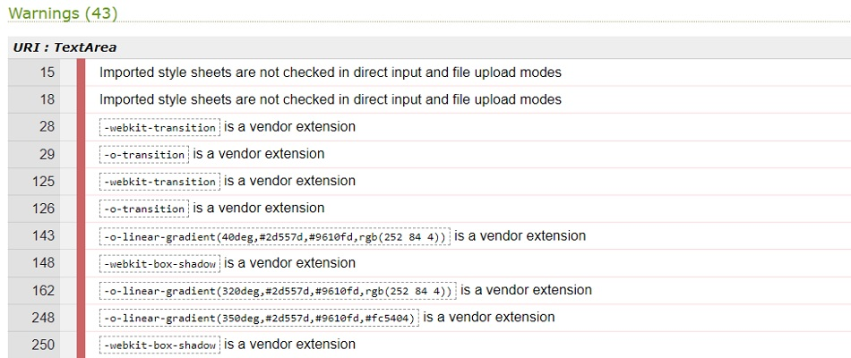
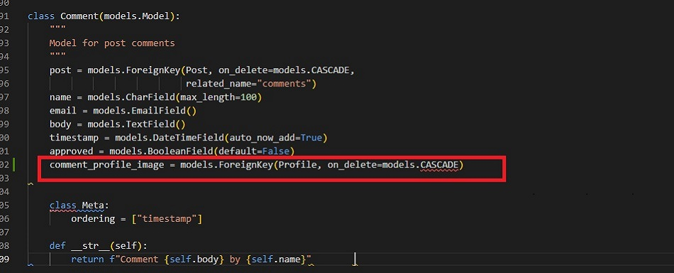
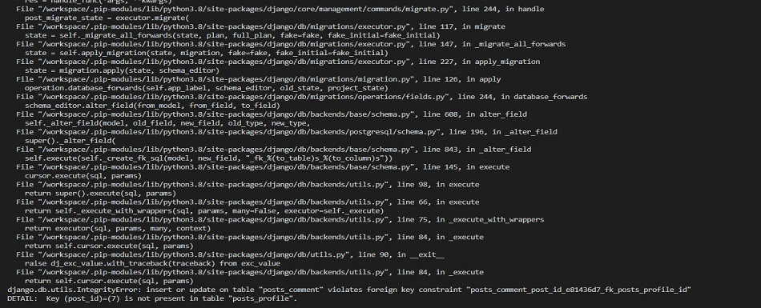

# Testing
Back to the [README](README.md)

* Testing has taken place continuously throughout the development of the website. Each view was
 tested regularly. When the outcome produced was not as expected, debugging was undertaken at that point.  

### Python Validation - PEP8
* Python testing was done using the PEP8 Online to ensure there were no syntax errors in the project. All python files
were entered into the online checker and no errors were found in any of the custom codes.

#### Tasty Blog - Blog
* [apps.py](./assets/images/readme/test/pep8/blog_pep8_apps.jpg)
* [forms.py](./assets/images/readme/test/pep8/blog_pep8_forms.jpg)
* [urls.py](./assets/images/readme/test/pep8/blog_pep8_urls.jpg)
* [views.py](./assets/images/readme/test/pep8/blog_pep8_views.jpg)
* [context_processors.py](./assets/images/readme/test/pep8/blog_pep8_context_processor.jpg)

#### Tasty Blog - Posts
* [admin.py](./assets/images/readme/test/pep8/posts_pep8_admin.jpg)
* [apps.py](./assets/images/readme/test/pep8/posts_pep8_apps.jpg)
* [models.py](./assets/images/readme/test/pep8/posts_pep8_models.jpg)

#### Tasty Blog - Users
* [apps.py](./assets/images/readme/test/pep8/users_pep8_apps.jpg)
* [signals.py](./assets/images/readme/test/pep8/users_pep8_signals.jpg)

#### Tasty Blog - Tastyblog
* [asgi.py](./assets/images/readme/test/pep8/tastyblog_pep8_asgi.jpg)
* [urls.py](./assets/images/readme/test/pep8/tastyblog_pep8_urls.jpg)
* [wsgi.py](./assets/images/readme/test/pep8/tastyblog_pep8_wsgi.jpg)
* [settings.py](./assets/images/readme/test/pep8/tastyblog_pep8_settings.jpg)
* A few errors were raised in the tastyblog/settings.py file, however these were related to default django authorisation
code and could not be changed to remove the errors.
* [manage.py](./assets/images/readme/test/pep8/pep8_manage.jpg)

### Lighthouse
Lighthouse was used to test Performance, Best Practices, Accessibility and SEO on Desktop.

##### Desktop Results:
.

###### Mobile Results:
.

### HTML Validation
.

### CSS Validation
* Custom CSS was validated using W3C Jigsaw validation service. Forty-three warnings were displayed, however, 
  these are related to Google Fonts and vendor extension prefixes which will not affect the CSS performance.
.
.

### JavaScript Validation
.

### jQuery Validation
.

## Manual Testing
### Frontend
* The Signup, Login and Logout system has no issues and is working properly and it shows the right interactive message
  back to the users.
* The Profile Page is working properly it updates the user information and uploads/updates the user profile image.
  It shows the interactive message back to the user once is done.
* The user profile image in the navbar and Post Details page has no issues and shows the user image once uploaded by the
  user on the Profile Page.
* All the internal links are working fine and bring the user to the right page on the website.
* All the external links are working fine and bring the user to the right social media page by opening a new browser
  tab.
* The Categories Page shows the recipes filtered by category without issues.
* The drop-down menu in the navbar shows a list of categories on every page of the website.
* The contact form on the Contact Page is working without problems it sends, to the info@tastyblog,
  an email once the user fill-up the form and clicks on the send button. Both interactive messages for email
  success or failure are also displayed on the screen.
* The pagination system is working right and adds another page after 6 posts on the page.
* On the Post Details Page, the Like/unlike functionality is working without issues and shows the right 
  interactive message back to the user when the heart icon is clicked.
* The comment form has no issues and it submits a new comment once filled up, by a registered user, 
  and the submit button is pressed. The two interactive messages for this action are working fine.  
* The functionality to delete a message, sent by the user previously, is working without issues and the 
  Bootstrap model is opening to ask the user if they really wanna delete the message. Once is done the interactive 
  message for this action is displayed at the top of the page.  

### Backend/Admin Panel
* I have tested the Admin Panel insistently since the beginning of the project development. All the models are working 
    without issues I have created, deleted, and updated data in all of them without errors. They have the behavior expected 
    for what they were built for.
* Whenever a user comments on a post the Superuser has to approve it before it will be displayed on the website. This functionality is 
    working without issues.  
* When the author is posting a new recipe all the required fields has to be filled otherwise the author can't submit the post to the database. 
  
## Bugs
### Terminal Bug
#### Comment Model 

#### Terminal Error

* While I was developing the project I tried to add a comment profile Image to the comments model 
  by adding a foreign key relating to the profile model. When I was doing the migrations I was asked by 
  the terminal for a default number for the new foreign key I add the number zero, I thought it was 
  the right way to add it at this stage of the project. I was wrong  I shouldn't add the number zero as 
  the default. When I run the migrations I got an error message on the terminal, saying that "(post_id)=(7) is not present in the table".

### Fixed Bug

* After hours of trying to figure out out to clear this error on the terminal by asking my colleagues on the Slack 
  community and searching online, I decided to call the Code Institute Tutor Assistance. I was advised, by the 
  tutor, to reset my database on Heroku and then run migrate on the terminal. I followed the advice and I fixed 
  the issue by resetting my project database.
