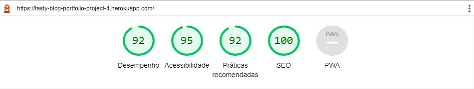
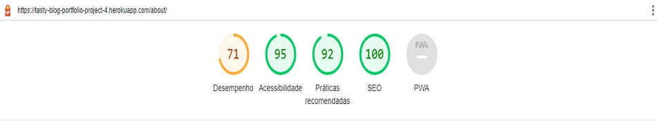
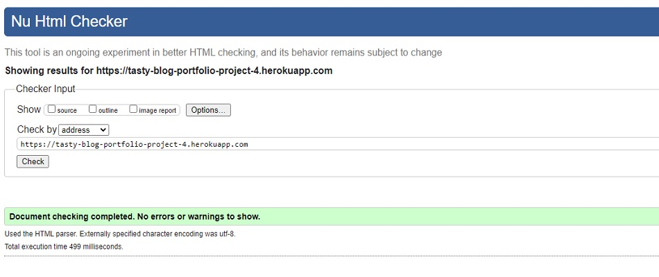
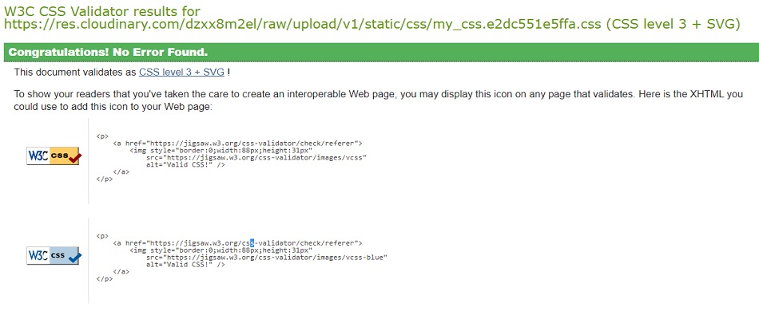
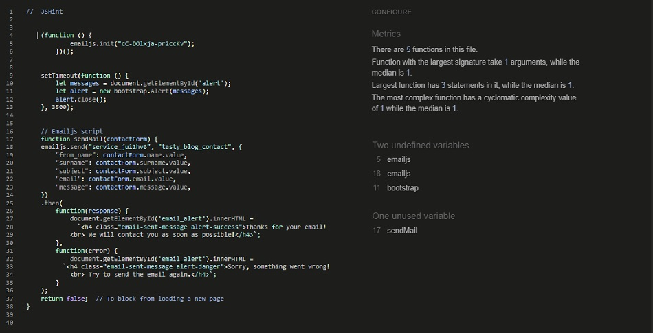
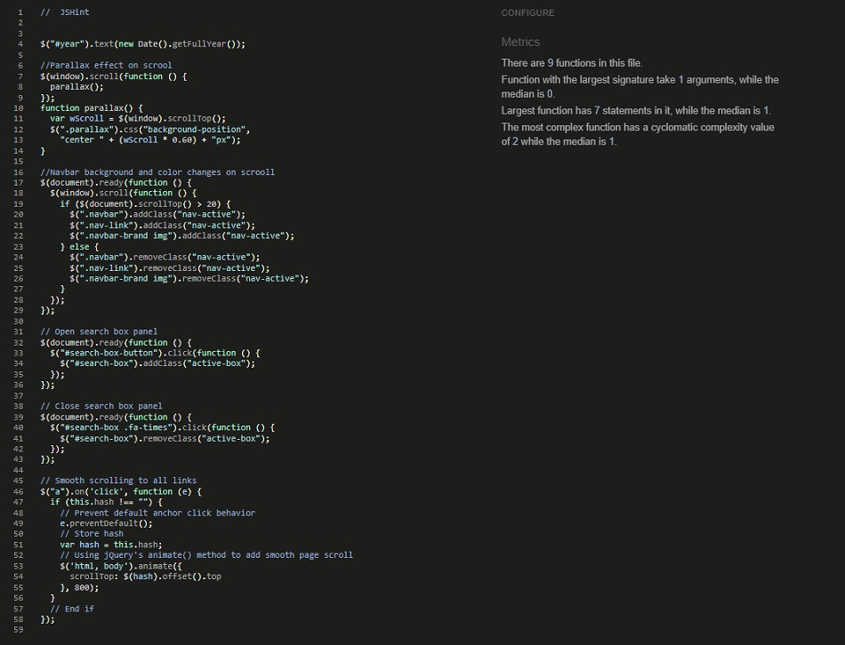

## Testing

Back to the [README](README.md)

### Python Validation - PEP8
* Python testing was done using the PEP8 Online. All python files were entered into the online checker and no errors were found in any of the custom codes.

#### Tasty Blog - Blog 
* [apps.py](./assets/images/readme/test/pep8/blog_pep8_apps.jpg)
* [forms.py](./assets/images/readme/test/pep8/blog_pep8_forms.jpg)
* [urls.py](./assets/images/readme/test/pep8/blog_pep8_urls.jpg)
* [views.py](./assets/images/readme/test/pep8/blog_pep8_views.jpg)
* [context_processors.py](./assets/images/readme/test/pep8/blog_pep8_context_processor.jpg)

#### Tasty Blog - Posts
* [admin.py](./assets/images/readme/test/pep8/posts_pep8_admin.jpg)
* [apps.py](./assets/images/readme/test/pep8/posts_pep8_apps.jpg)
* [models.py](./assets/images/readme/test/pep8/posts_pep8_models.jpg)

#### Tasty Blog - Users
* [apps.py](./assets/images/readme/test/pep8/users_pep8_apps.jpg)
* [signals.py](./assets/images/readme/test/pep8/users_pep8_signals.jpg)

#### Tasty Blog - Tastyblog
* [asgi.py](./assets/images/readme/test/pep8/tastyblog_pep8_asgi.jpg)
* [urls.py](./assets/images/readme/test/pep8/tastyblog_pep8_urls.jpg)
* [wsgi.py](./assets/images/readme/test/pep8/tastyblog_pep8_wsgi.jpg)
* [settings.py](./assets/images/readme/test/pep8/tastyblog_pep8_settings.jpg)
* A few errors were raised in the tastyblo/settings.py file, however these were related to default django authorisation code and could not be changed to remove the errors.

The [PEP8](http://pep8online.com/) Validator Service was used to validate every Python file in the project to ensure there were no syntax errors in the project.

.
* No errors or warnings were found during the testing of the code in PEP8
  
### Lighthouse 
 Lighthouse was used to test Performance, Best Practices, Accessibility and SEO on Desktop. 

##### Desktop Results:
.

###### Mobile Results:
.

### HTML Validation
.

### CSS Validation
.

### JavaScript Validation
.

### jQuery Validation
.

## Functionality 
* The terminal has no issues and is working properly 
* The typewriter starts typing at the right time and is working correctly 
* The input for name and city have the right behaviour and shows the user an alert if the input is empty
* The game rules appear without any issues after the player submits their name and city
* The option to press any key to start a game is running well
* The game runs without any issues and as expected 
* At the end of the game the Leaderboard is updating correctly
* All the menu options are working without any fails

## Bugs 
### Python Lines too Long

* When I first built the ASCII art for the logo I got the warning "line too long (126 > 79 characters)" from PEP8. 

### Fixed Bug

* I had to rebuild the logo using the program  Patorjk (ASCII Art Generator) to avoid these issues.
