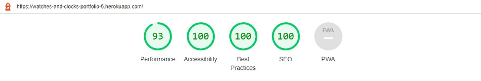
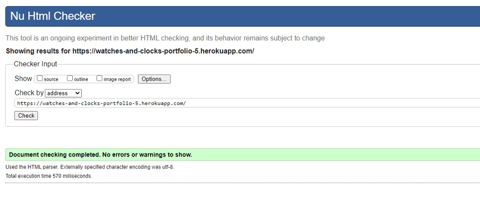
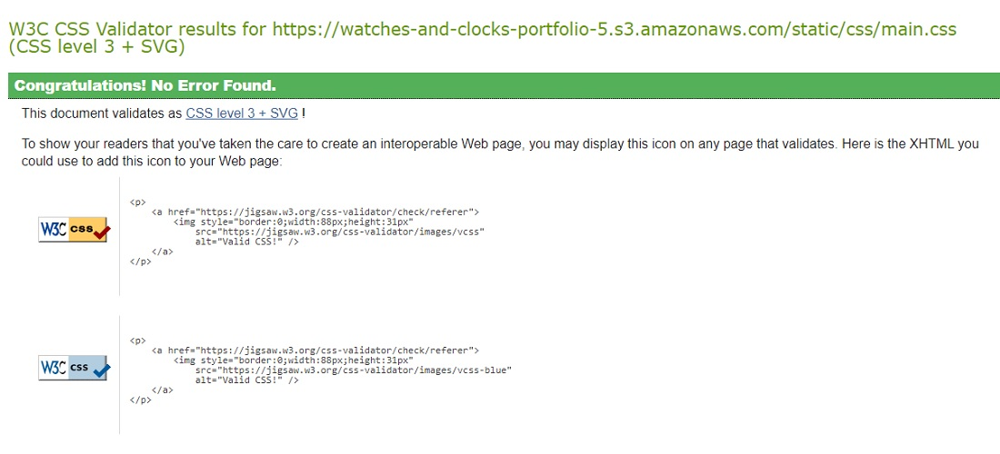
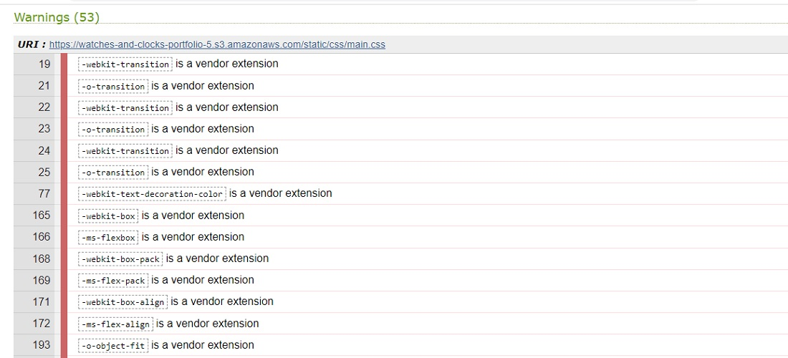
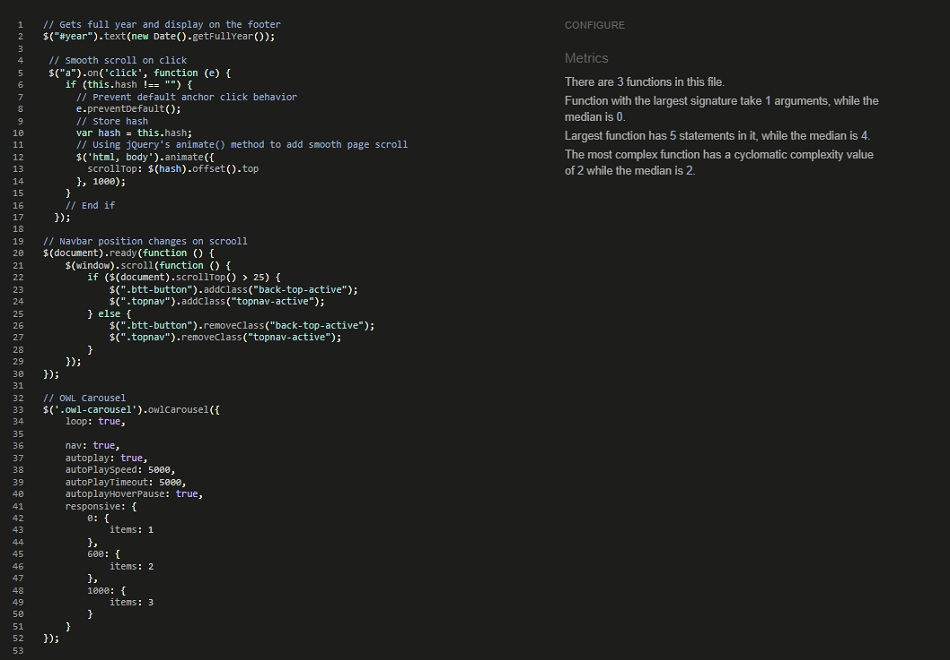
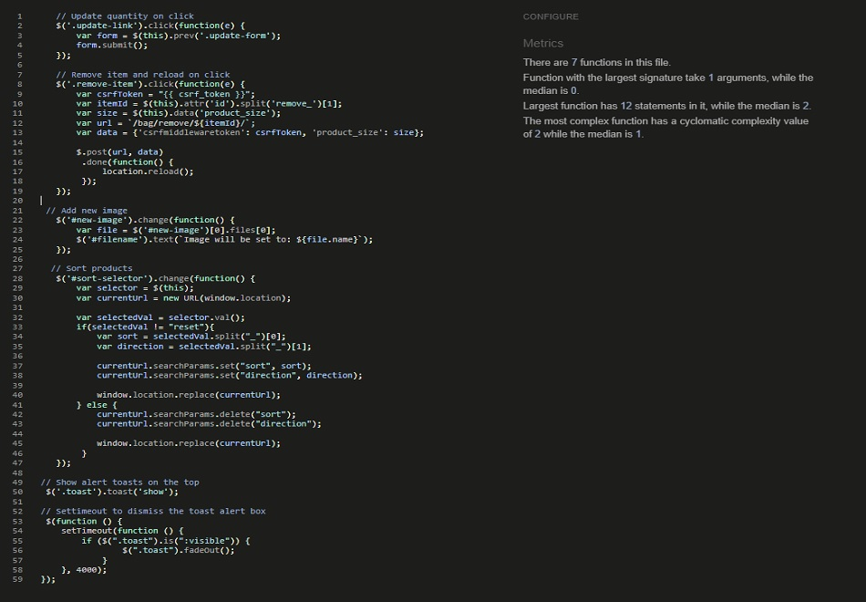
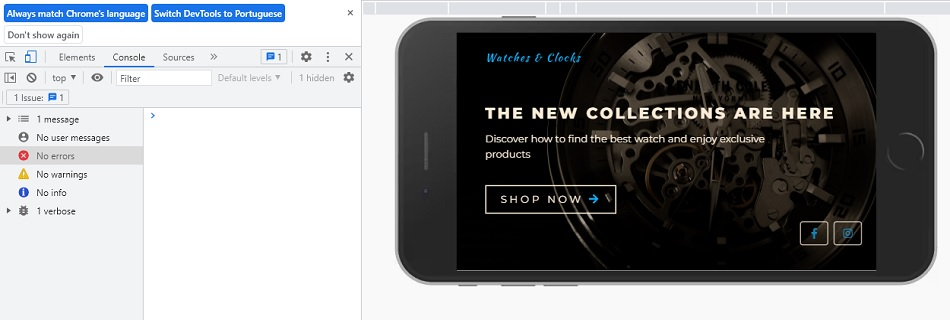

# Testing
Back to the [README](README.md)

* Testing has taken place continuously throughout the development of the project. Each view was tested regularly. 
  When the outcome was not as expected, debugging took place at that point.  

### Python Validation - PEP8
* Python testing was done using the Pycodestyle to ensure there were no syntax errors in the project. All python files
were entered into the checker and no errors were found in any of the custom codes.

#### Checked Python Files

#### App - Bag
* apps.py
* context.py
* urls.py
* views.py
  
#### Banners - Bag
* admin.py
* apps.py
* context_processors.py
* models.py
* urls.py
* views.py
* 
#### Checkout - Bag
* admin.py
* apps.py
* forms.py
* models.py
* signals.py
* urls.py
* views.py
* webhook_handler.py
* webhooks.py
* 
#### Home - Bag
* admin.py
* apps.py
* models.py
* urls.py
* views.py

#### Products - Bag
* admin.py
* apps.py
* context_processors.py
* forms.py
* models.py
* urls.py
* views.py
* widgets.py
  
#### Profiles - Bag
* admin.py
* apps.py
* forms.py
* models.py
* urls.py
* views.py
  
#### Reviews - Bag
* admin.py
* apps.py
* context_processors.py
* forms.py
* models.py
* urls.py
* views.py
* widgets.py

#### Project - watches_and_clocks
* asgi.py
* urls.py
* wsgi.py
* settings.py
* A few errors were raised in the tastyblog/settings.py file, however these were related to default django authorisation
code and could not be changed to remove the errors.
* manage.py

### Lighthouse
Lighthouse was used to test Performance, Best Practices, Accessibility and SEO on Desktop.

##### Desktop Results:
.

###### Mobile Results:
.

### HTML Validation
.

### CSS Validation
* Custom CSS was validated using W3C Jigsaw validation service. Fifty-three warnings were displayed, however, 
  these are related to Google Fonts and vendor extension prefixes which will not affect the CSS performance.
  
.
.

### jQuery Validation
.
.

### Console Results
.

## Manual Testing
### Frontend
* The Signup, Login and Logout system has no issues and is working accordingly. It shows the right 
  interactive message to the users.
* The Profile Page is working properly. It updates the user information. It shows the interactive message to the user once the update is complete.
* All the internal links are working and bring the user to the right page on the website.
* All the external links are working and bring the user to the right social media page by 
  opening a new browser tab.
* The Categories Page shows the recipes filtered by category without issues.
* The drop-down menu in the navbar shows a list of categories on every page of the website.
* The contact form on the Contact Page is working without any errors.  It sends an email, 
  to the info@tastyblog, once the user fills in the form and clicks on the send button. 
  Both interactive messages for email success or failure are also displayed on the screen.
* The pagination system is working. It adds another page after 6 posts on the page.
* On the Post Details Page, the Like/unlike functionality is working without issues and shows 
  the right interactive message to the user when the heart icon is clicked.
* The comment form has no issues and it submits a new comment once the form is completed by a
  registered user. 
  The comment is displayed once the submit button is pressed. The two interactive messages for 
  this action are working without errors. 
* The functionality to delete a message, previously sent by the user or by the superuser, is 
  working without issues. The Bootstrap model is open to asking the user if they want to delete 
  the message. Once the action is complete, the interactive message is displayed at the top of the page.
* The functionality to update a message, previously sent by the user or by the superuser, is 
  working without issues. A new page is open, to update the comment when the button edit is 
  pressed. Once the action is complete, the interactive message is displayed at the top of the page. 

### Backend/Admin Panel
* I have tested the Admin Panel repeatedly since the start of the project development. All the models are working without issues.  
  I have created, deleted, and updated data in all models without errors. The models have the behavior expected for what they were built for.
* Whenever a user comments on a post the Superuser has to approve it before it will be displayed on the website. This functionality is 
  working without issues.
* When the author is posting a new recipe all the required fields have to be filled otherwise the author can't submit the post to the database.

### Manual Test Case
The Test case for this project can be found [here](https://docs.google.com/spreadsheets/d/100bSOz3C9ra1K0PpAldBvg7NzoyHEMZZjpIWfiHnkQU/edit#gid=0)
  
## Bugs
